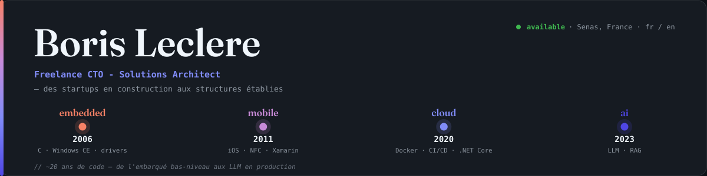
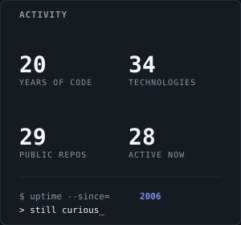

<div align="right">
<sub><a href="README.md">🇫🇷 Français</a> · <b>🇬🇧 English</b></sub>
</div>

<div align="center">

<a href="mailto:borisleclere.pro@gmail.com">
  <picture>
    <source media="(prefers-color-scheme: dark)" srcset="assets/svg/en/dark/header.svg" />
    
  </picture>
</a>

<picture>
  <source media="(prefers-color-scheme: dark)" srcset="https://readme-typing-svg.demolab.com/?font=JetBrains+Mono&weight=600&size=20&pause=1200&center=true&vCenter=true&width=600&height=45&color=c75d3e&lines=Freelance+CTO;Software+Architect;AI-Driven+Development" />
  
</picture>

</div>

<p align="center">

I support technical teams - both startups and more mature structures** - in their software strategy: choice of stack, architecture, technical debt, industrialization, production launch. I enjoy understanding a low-level protocol, orchestrating a CI/CD pipeline or plugging an LLM into an existing product. **My angle is versatility and a genuine curiosity about technology** - not a single playing field.

</p>

<div align="center">

<picture>
  <source media="(prefers-color-scheme: dark)" srcset="assets/svg/en/dark/services.svg" />
  
</picture>

</div>

<div align="center">

<picture>
  <source media="(prefers-color-scheme: dark)" srcset="assets/svg/en/dark/core-expertise.svg" />
  
</picture>

</div>

<div align="center">

<a href="https://github.com/Rinzler78?tab=repositories">
  <picture>
    <source media="(prefers-color-scheme: dark)" srcset="assets/svg/en/dark/featured-projects.svg" />
    
  </picture>
</a>

</div>

<table align="center">
  <tr>
    <td valign="top" width="52%">
      <picture>
        <source media="(prefers-color-scheme: dark)" srcset="assets/svg/en/dark/stack-summary.svg" />
        
      </picture>
    </td>
    <td valign="top" width="26%">
      <picture>
        <source media="(prefers-color-scheme: dark)" srcset="assets/svg/en/dark/activity-stats.svg" />
        
      </picture>
    </td>
    <td valign="top" width="22%">
      <picture>
        <source media="(prefers-color-scheme: dark)" srcset="assets/svg/en/dark/timeline-mini.svg" />
        
      </picture>
    </td>
  </tr>
</table>

<div align="center">

<picture>
  <source media="(prefers-color-scheme: dark)" srcset="assets/svg/en/dark/methodology.svg" />
  
</picture>

</div>

<div align="center">

<sub><b>Live GitHub activity</b></sub>

<picture>
  <source media="(prefers-color-scheme: dark)" srcset="https://github-readme-activity-graph.vercel.app/graph?username=Rinzler78&hide_border=true&area=true&bg_color=ffffff&color=1a1a1f&line=c75d3e&point=c75d3e&title_color=c75d3e" />
  
</picture>

<table>
  <tr>
    <td valign="middle" width="40%">
      <picture>
        <source media="(prefers-color-scheme: dark)" srcset="https://github-readme-stats.vercel.app/api?username=Rinzler78&show_icons=true&hide_rank=true&hide_border=true&bg_color=ffffff&title_color=c75d3e&text_color=1a1a1f&icon_color=c75d3e" />
        
      </picture>
    </td>
    <td valign="middle" width="60%">
      <picture>
        <source media="(prefers-color-scheme: dark)" srcset="https://raw.githubusercontent.com/Rinzler78/Rinzler78/output/github-contribution-grid-snake-dark.svg" />
        
      </picture>
    </td>
  </tr>
</table>

</div>

<details>
<summary><code>$ cat Boris.cs  # profile as code</code></summary>

```csharp
public sealed class BorisLeclere : FreelanceCto
{
    public string[] CoreSkills => ["C# / .NET", "Bluetooth / BLE / GATT", "AI-Driven Development", "Python"];
    public string[] Services   => ["Software architecture & redesign", "Technical audit", "MVP design & delivery", "CI/CD industrialization & delivery", "AI-Driven Development", "Developer tooling & automation"];
    public string   Status     => "available";
}
```

</details>

<details>
<summary><code>$ ./stack --detailed  # technical stack, all skills</code></summary>

<br/>

**Embedded &amp; Systems**

| Skill | Now | Peak | Active | Versions |
|---|---|---|---|---|
| Bluetooth / BLE / GATT | expert | expert | 2011–2023 | Classic + BLE 4.x · custom GATT |
| Linux / Ubuntu | advanced | advanced | 2020–now | 22.04 LTS |
| Windows | professional | professional | 2011–now | 3.11 → 11 + Server |
| Windows CE | working | professional | 2006–2012 | 5.0 / 6.0 |
| NFC | explored | working | 2011–2014 | ISO 14443 / 15693 (Mifare) |
| GPS | explored | working | 2009–2012 | NMEA · A-GPS |
| Computer Vision (embedded) | explored | explored | 2008–2009 | Industrial camera · PIC16F1938 |
**Mobile**

| Skill | Now | Peak | Active | Versions |
|---|---|---|---|---|
| Xamarin (Forms, iOS, Android) | expert | expert | 2014–now | Forms 2.3 → 4.7 · Essentials 1.x |
| Windows Mobile | explored | explored | 2013–2014 | 6.x |
**Languages**

| Skill | Now | Peak | Active | Versions |
|---|---|---|---|---|
| C# / .NET | expert | expert | 2006–now | C# 2.0 → 13 · .NET Framework 2.0 → .NET 10 |
| Python | advanced | advanced | 2022–now | 3.11+ |
| C / C++ | professional | expert | 2006–2013 | C99 · C++11 · C++/CLI |
| Bash / Shell | professional | professional | 2014–now | Bash 5.x |
| Objective-C | working | working | 2011–2020 | iOS 5 → 10 |
| TypeScript | explored | explored | 2023–now | 5.x |
**Backend &amp; Web**

| Skill | Now | Peak | Active | Versions |
|---|---|---|---|---|
| ASP.NET Web API 2 | professional | advanced | 2014–2020 | Framework 4.x |
| Microsoft Azure | working | working | 2014–now | App Insights · Notification Hubs |
| ASP.NET Core | working | working | 2020–2023 | 2.2 → 8 |
| Entity Framework | working | working | 2020–2023 | EF6 → EF Core 3.1+ |
| Blazor (WASM &amp; Server) | working | working | 2020–2023 | .NET 6+ |
| Node.js | explored | explored | 2019–now | 20 / 22 / 24 |
| FastAPI | explored | explored | 2023–now | 0.110+ |
| React + Next.js | explored | explored | 2023–now | React 18+, Next 14+ |
**DevOps &amp; Infrastructure**

| Skill | Now | Peak | Active | Versions |
|---|---|---|---|---|
| Git | expert | expert | 2009–now | 2.x |
| Docker | advanced | advanced | 2020–now | 24.x+ · Compose v2 |
| GitHub Actions | professional | professional | 2014–now | — |
**AI &amp; LLM**

| Skill | Now | Peak | Active | Versions |
|---|---|---|---|---|
| AI-Driven Development | advanced | advanced | 2022–now | Claude Code (primary) · Codex · OpenCode · ChatGPT |
| LiteLLM | explored | explored | 2023–now | — |
| Anthropic Claude API / SDK | explored | explored | 2023–now | SDK 0.x |
**Blockchain**

| Skill | Now | Peak | Active | Versions |
|---|---|---|---|---|
| Cosmos SDK | explored | explored | 2022–now | Client integration |
| Osmosis (OSMO) | explored | explored | 2022–now | Node ops · launcher tuning |
| CometBFT | explored | explored | 2023–now | REST · WebSocket · gRPC |
| Idena | explored | explored | 2020–now | Node ops |
| AIOZ Network | explored | explored | 2023–now | Node ops |
</details>

<div align="center">

<picture>
  <source media="(prefers-color-scheme: dark)" srcset="assets/svg/en/dark/modes.svg" />
  
</picture>

</div>

<div align="center">

<a href="https://www.openstreetmap.org/?mlat=43.74&mlon=5.06#map=9/43.74/5.06">
  <picture>
    <source media="(prefers-color-scheme: dark)" srcset="assets/map-dark.png" />
    
  </picture>
</a>

</div>

<div align="center">

<sub><b>Built like a product.</b> This profile is generated from JSON, validated against schemas, scored from real exposure hours, tested (90%+ coverage), linted, security-scanned, spell-checked (en + fr), and regenerated on every commit — pre-commit + pre-push gates, GitHub Actions CI, branch protection. <b>The repo is the proof.</b></sub>
</div>

<div align="center">

<a href="mailto:borisleclere.pro@gmail.com"></a>
<a href="tel:+33626263461"></a>
<a href="https://wa.me/33626263461"></a>
<a href="https://www.linkedin.com/in/borisleclere"></a>
<a href="https://www.malt.fr/profile/borisleclere"></a>
<a href="https://pypi.org/user/Rinzler78"></a>
<a href="https://discordapp.com/users/rinzler84"></a>
<a href="https://twitter.com/BorisLeclere"></a>

<sub><a href="tel:+33626263461">+33 6 26 26 34 61</a>  &nbsp;·&nbsp;  <a href="https://wa.me/33626263461">WhatsApp</a>  &nbsp;·&nbsp;  <code>EOF · github.com/Rinzler78 · 2026 — still curious, still shipping_</code></sub>

</div>

<details>
<summary><code>$ cat ~/.bashrc  # easter eggs</code></summary>

```
[OK] curiosity      … mounted at /home/boris
[OK] coffee         … daemon running on :8080
[OK] basketball.so  … loaded since 1991
[WARN] imposter.sys … signal ignored
[OK] embedded.ko    … 2006 → 2013
[OK] mobile.ko      … 2011 →
[OK] cloud.ko       … 2020 →
[OK] llm.ko         … 2023 →
[OK] provence.env   … exported PATH=$PATH:/sunlight
```

```
// pragma: humanity
// FIXME: shave fewer yaks
// ls projects/ --sort=love-desc
// pulse check
// human.boris{ basketball: true, papa: true }
// open socket
```

</details>

<sub align="center">

Basketball coach in Pélissanne, Provence, after picking up a ball for the first time at age 7 (and never really letting go since). Self-taught from BEP Electrotechnique to Master in Embedded Systems. Father of a future developer.

</sub>

**Direct links :** [FFBBApiClientV2_Python](https://github.com/Rinzler78/FFBBApiClientV2_Python) · [CometBFT.Client](https://github.com/Rinzler78/CometBFT.Client) · [osmosis-launcher](https://github.com/Rinzler78/osmosis-launcher) · [docker.idena-node](https://github.com/Rinzler78/docker.idena-node) · [aioz-node-docker](https://github.com/Rinzler78/aioz-node-docker) · [Here.Sdk.Common](https://github.com/Rinzler78/Here.Sdk.Common) · [NetExtension](https://github.com/Rinzler78/NetExtension) · [docker-cleaner](https://github.com/Rinzler78/docker-cleaner)