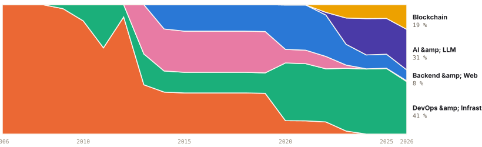
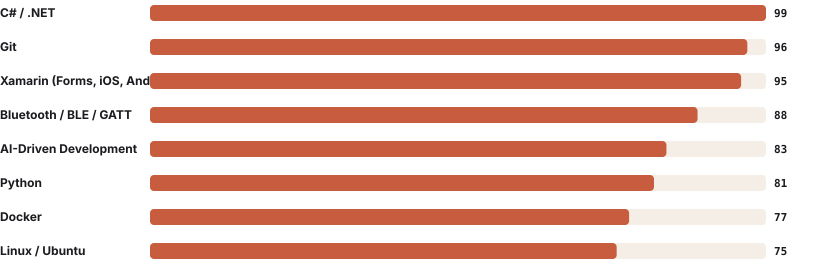
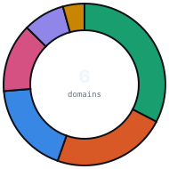
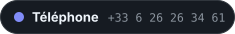

<div align="right">
<sub><a href="README.md">🇫🇷 Français</a> · <b>🇬🇧 English</b></sub>
</div>

<div align="center">

<a href="mailto:borisleclere.pro@gmail.com">
  <picture>
    <source media="(prefers-color-scheme: dark)" srcset="assets/svg/en/dark/header.svg" />
    
  </picture>
</a>

**Freelance CTO**&nbsp;&nbsp;·&nbsp;&nbsp;**Software Architect**&nbsp;&nbsp;·&nbsp;&nbsp;**AI-Driven Development**

</div>

<p align="center">

I support technical teams - both startups and more mature structures** - in their software strategy: choice of stack, architecture, technical debt, industrialization, production launch. I enjoy understanding a low-level protocol, orchestrating a CI/CD pipeline or plugging an LLM into an existing product. **My angle is versatility and a genuine curiosity about technology** - not a single playing field.

</p>

<div align="center">

### Explore
**[Stack](pages/en/stack.md)**  ·  **[Journey](pages/en/journey.md)**  ·  **[Projects](pages/en/projects.md)**  ·  **[Working with me](pages/en/working-with-me.md)**

</div>

<div align="center">


<sub><b>Où le temps est passé</b></sub>

<picture>
  <source media="(prefers-color-scheme: dark)" srcset="assets/svg/en/dark/journey-share.svg" />
  
</picture>

<sub>**L'arc se lit directement.** L'embarqué occupe l'essentiel de 2006 à 2013, le mobile prend le relais jusqu'en 2019, le cloud domine à partir de 2020, l'IA apparaît en 2023. Chaque année est ramenée à 100 % : c'est une répartition, pas un volume.</sub>

<sub><b>Compétences les mieux ancrées</b></sub>

<picture>
  <source media="(prefers-color-scheme: dark)" srcset="assets/svg/en/dark/top-skills.svg" />
  
</picture>

<sub>**Le score vient des heures d'exposition réelles** — expériences datées et jours de commits — jamais d'une auto-évaluation. C# / .NET à 99 sur vingt ans ; l'AI-Driven Development déjà à 83 en trois ans.</sub>

<sub><b>Un profil large</b></sub>

<picture>
  <source media="(prefers-color-scheme: dark)" srcset="assets/svg/en/dark/domain-split.svg" />
  
</picture>

<sub>**Polyvalent, pas dispersé.** Le DevOps concentre un tiers de l'exposition, mais quatre domaines dépassent chacun 13 %. Les parts se recoupent volontairement — une mission compte dans chaque domaine qu'elle touche — donc seuls les pourcentages sont affichés, jamais un total d'heures.</sub>

<sub><b>Core expertise</b></sub>

<picture>
  <source media="(prefers-color-scheme: dark)" srcset="assets/svg/en/dark/core-expertise.svg" />
  
</picture>

<sub><b>Stack by domain</b></sub>

<picture>
  <source media="(prefers-color-scheme: dark)" srcset="assets/svg/en/dark/stack-summary.svg" />
  
</picture>

<sub>The full table, version by version, is on the **[stack page](pages/en/stack.md)**.</sub>

<sub><b>Public projects</b></sub>

<picture>
  <source media="(prefers-color-scheme: dark)" srcset="assets/svg/en/dark/featured-projects.svg" />
  
</picture>

<sub><b>Milestones</b></sub>

<picture>
  <source media="(prefers-color-scheme: dark)" srcset="assets/svg/en/dark/timeline-mini.svg" />
  
</picture>

<sub><b>What you can buy</b></sub>

<picture>
  <source media="(prefers-color-scheme: dark)" srcset="assets/svg/en/dark/services.svg" />
  
</picture>

<sub><b>How to engage me</b></sub>

<picture>
  <source media="(prefers-color-scheme: dark)" srcset="assets/svg/en/dark/modes.svg" />
  
</picture>

<sub><b>How I work</b></sub>

<picture>
  <source media="(prefers-color-scheme: dark)" srcset="assets/svg/en/dark/methodology.svg" />
  
</picture>

<sub><b>Activity</b></sub>

<picture>
  <source media="(prefers-color-scheme: dark)" srcset="assets/svg/en/dark/activity-stats.svg" />
  
</picture>

</div>

<div align="center">

<a href="https://www.openstreetmap.org/?mlat=43.74&mlon=5.06#map=9/43.74/5.06">
  <picture>
    <source media="(prefers-color-scheme: dark)" srcset="assets/map-dark.png" />
    
  </picture>
</a>

</div>

<div align="center">

<sub><b>Built like a product.</b> This profile is generated from JSON, validated against schemas, scored from real exposure hours, tested (90%+ coverage), linted, security-scanned, spell-checked (en + fr), and regenerated on every commit — pre-commit + pre-push gates, GitHub Actions CI, branch protection. <b>The repo is the proof.</b></sub>
</div>

<div align="center">

<a href="mailto:borisleclere.pro@gmail.com"><picture><source media="(prefers-color-scheme: dark)" srcset="assets/svg/en/dark/chip-email.svg" /></picture></a><a href="tel:+33626263461"><picture><source media="(prefers-color-scheme: dark)" srcset="assets/svg/en/dark/chip-phone.svg" /></picture></a><a href="https://wa.me/33626263461"><picture><source media="(prefers-color-scheme: dark)" srcset="assets/svg/en/dark/chip-whatsapp.svg" /></picture></a><a href="https://www.linkedin.com/in/borisleclere"><picture><source media="(prefers-color-scheme: dark)" srcset="assets/svg/en/dark/chip-linkedin.svg" /></picture></a><a href="https://www.malt.fr/profile/borisleclere"><picture><source media="(prefers-color-scheme: dark)" srcset="assets/svg/en/dark/chip-malt.svg" /></picture></a><a href="https://pypi.org/user/Rinzler78"><picture><source media="(prefers-color-scheme: dark)" srcset="assets/svg/en/dark/chip-pypi.svg" /></picture></a><a href="https://discordapp.com/users/rinzler84"><picture><source media="(prefers-color-scheme: dark)" srcset="assets/svg/en/dark/chip-discord.svg" /></picture></a><a href="https://twitter.com/BorisLeclere"><picture><source media="(prefers-color-scheme: dark)" srcset="assets/svg/en/dark/chip-twitter.svg" /></picture></a>
<sub><a href="tel:+33626263461">+33 6 26 26 34 61</a>  &nbsp;·&nbsp;  <a href="https://wa.me/33626263461">WhatsApp</a>  &nbsp;·&nbsp;  <code>EOF · github.com/Rinzler78 · 2026 — still curious, still shipping_</code></sub>

</div>

<details>
<summary><code>$ cat ~/.bashrc  # easter eggs</code></summary>

```
[OK] curiosity      … mounted at /home/boris
[OK] coffee         … daemon running on :8080
[OK] basketball.so  … loaded since 1991
[WARN] imposter.sys … signal ignored
[OK] embedded.ko    … 2006 → 2013
[OK] mobile.ko      … 2011 →
[OK] cloud.ko       … 2020 →
[OK] llm.ko         … 2023 →
[OK] provence.env   … exported PATH=$PATH:/sunlight
```

```
// pragma: humanity
// FIXME: shave fewer yaks
// ls projects/ --sort=love-desc
// pulse check
// human.boris{ basketball: true, papa: true }
// open socket
```

</details>

<sub align="center">

Basketball coach in Pélissanne, Provence, after picking up a ball for the first time at age 7 (and never really letting go since). Self-taught from BEP Electrotechnique to Master in Embedded Systems. Father of a future developer.

</sub>

**Direct links :** [FFBBApiClientV2_Python](https://github.com/Rinzler78/FFBBApiClientV2_Python) · [CometBFT.Client](https://github.com/Rinzler78/CometBFT.Client) · [osmosis-launcher](https://github.com/Rinzler78/osmosis-launcher) · [docker.idena-node](https://github.com/Rinzler78/docker.idena-node) · [aioz-node-docker](https://github.com/Rinzler78/aioz-node-docker) · [Here.Sdk.Common](https://github.com/Rinzler78/Here.Sdk.Common) · [NetExtension](https://github.com/Rinzler78/NetExtension) · [docker-cleaner](https://github.com/Rinzler78/docker-cleaner)