

<a href="README.md">🇫🇷 Français</a> · <b>🇬🇧 English</b>

<picture><source media="(prefers-color-scheme: light)" srcset="assets/svg/en/light/identity.svg" />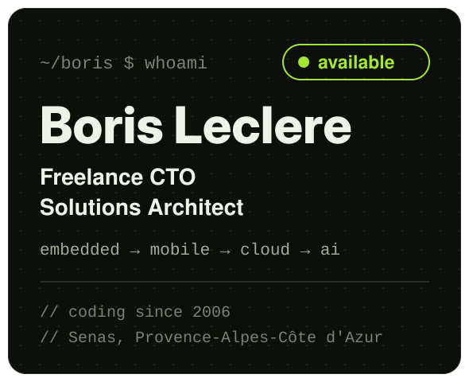</picture> <picture><source media="(prefers-color-scheme: light)" srcset="assets/svg/en/light/figures.svg" />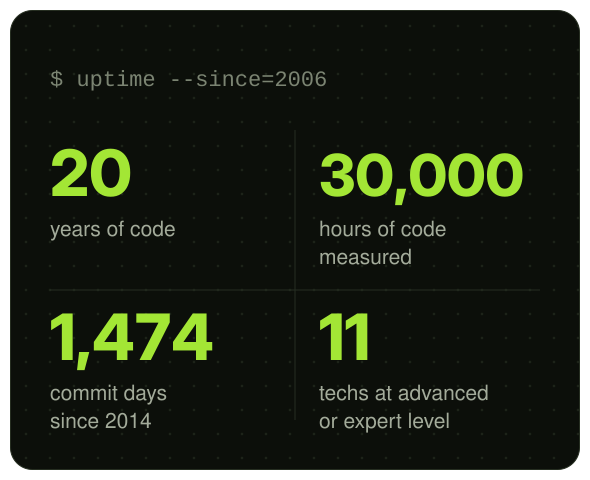</picture>

[borisleclere.pro@gmail.com](mailto:borisleclere.pro@gmail.com) · [LinkedIn](https://www.linkedin.com/in/borisleclere) · [Malt](https://www.malt.fr/profile/borisleclere) · [GitHub](https://github.com/Rinzler78) · [PyPI](https://pypi.org/user/Rinzler78)

Freelance CTO - Solutions Architect, coding since 2006. On the clock: 20 years of code, about 30,000 measured hours of practice, 1,474 commit days since 2014 and 11 technologies at advanced or expert level.

## How I can help

I work with technical teams, from startups being built to established organizations, on 6 kinds of engagement:

- **Software architecture &amp; redesign** — Design or repair maintainable, testable and upgradeable systems. Get a codebase out of technical debt without rewriting the whole thing.
- **Technical audit** — Honest inventory: code, architecture, testing, CI/CD, security, documentation. An actionable report, prioritized by impact.
- **MVP design &amp; delivery** — Take a product from idea to market: pragmatic architecture, choice of stack, iterative delivery that holds the load.
- **CI/CD industrialization &amp; delivery** — Stabilize the delivery chain: Docker, GitHub Actions, reproducible releases, standardized dev environments.
- **AI-Driven Development** — Structuring the use of AI agents to deliver fast without chaos: specs, rules, memory, quality gates, controlled context.
- **Developer tooling &amp; automation** — Create time-saving tools for the team: CLIs, generators, scripts, internal APIs, custom automations.

Engagement formats: Part-time CTO · Solutions architect · Emergency technical support · Freelance technical co-founder.

## Open source

<picture><source media="(prefers-color-scheme: light)" srcset="assets/svg/en/light/oss-docker-cleaner.svg" />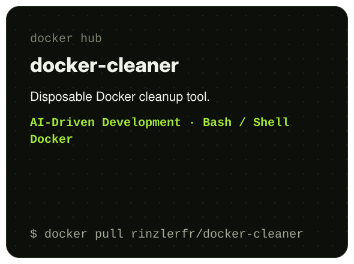</picture> <picture><source media="(prefers-color-scheme: light)" srcset="assets/svg/en/light/oss-ffbb-api-client-v2.svg" />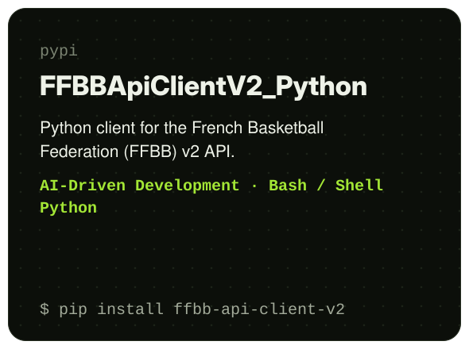</picture>

**docker-cleaner**   &nbsp;·&nbsp; **FFBBApiClientV2_Python**  

<picture><source media="(prefers-color-scheme: light)" srcset="assets/svg/en/light/oss-aioz-node-docker.svg" />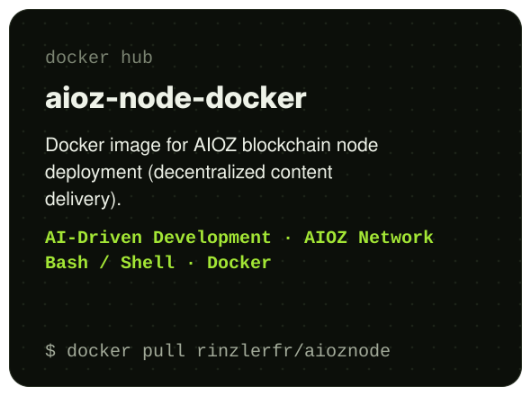</picture> <picture><source media="(prefers-color-scheme: light)" srcset="assets/svg/en/light/oss-docker-idena-node.svg" />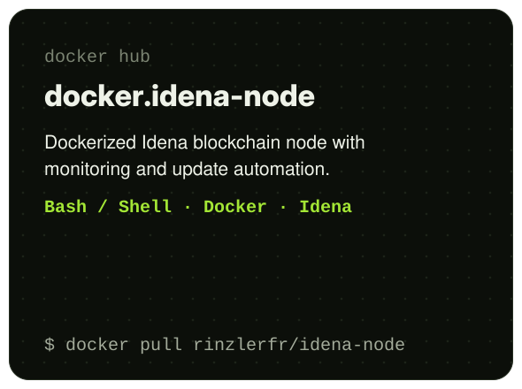</picture>

**aioz-node-docker**   &nbsp;·&nbsp; **docker.idena-node**  

<picture><source media="(prefers-color-scheme: light)" srcset="assets/svg/en/light/oss-ffbb-api-client-v1.svg" />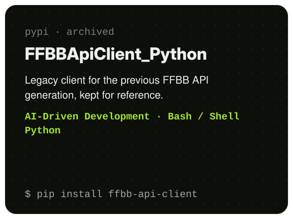</picture> <picture><source media="(prefers-color-scheme: light)" srcset="assets/svg/en/light/oss-aioz-node-auto-withdraw.svg" />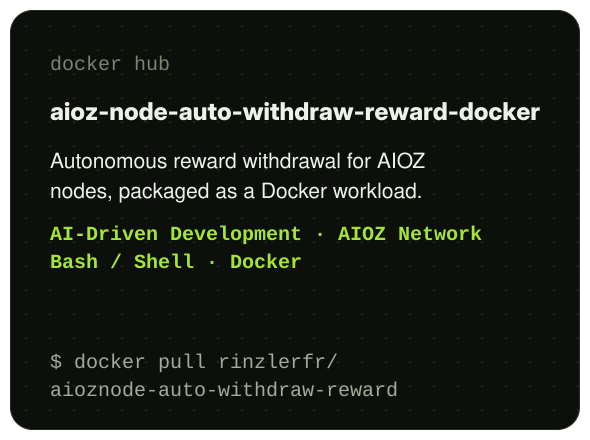</picture>

**FFBBApiClient_Python**   &nbsp;·&nbsp; **aioz-node-auto-withdraw-reward-docker**  

6 public projects published on Docker Hub and PyPI, with their counters read live under each tile.

## Skills

<picture><source media="(prefers-color-scheme: light)" srcset="assets/svg/en/light/skills-band-1.svg" /></picture> <picture><source media="(prefers-color-scheme: light)" srcset="https://skillicons.dev/icons?i=apple&amp;theme=light&amp;perline=16" /></picture> <picture><source media="(prefers-color-scheme: light)" srcset="assets/svg/en/light/skills-band-2.svg" />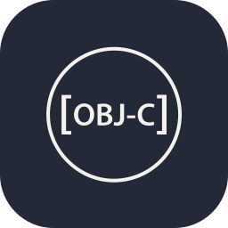</picture> <picture><source media="(prefers-color-scheme: light)" srcset="https://skillicons.dev/icons?i=windows,py,bash,cs,cpp,ts,html,java,matlab,dotnet&amp;theme=light&amp;perline=16" /></picture> <picture><source media="(prefers-color-scheme: light)" srcset="assets/svg/en/light/skills-band-3.svg" /></picture> <picture><source media="(prefers-color-scheme: light)" srcset="https://skillicons.dev/icons?i=docker&amp;theme=light&amp;perline=16" /></picture> <picture><source media="(prefers-color-scheme: light)" srcset="assets/svg/en/light/skills-band-4.svg" />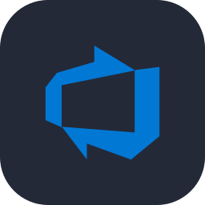</picture> <picture><source media="(prefers-color-scheme: light)" srcset="https://skillicons.dev/icons?i=git&amp;theme=light&amp;perline=16" /></picture> <picture><source media="(prefers-color-scheme: light)" srcset="assets/svg/en/light/skills-band-5.svg" />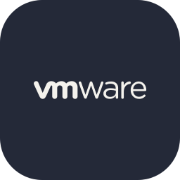</picture> <picture><source media="(prefers-color-scheme: light)" srcset="https://skillicons.dev/icons?i=linux&amp;theme=light&amp;perline=16" /></picture> <picture><source media="(prefers-color-scheme: light)" srcset="assets/svg/en/light/skills-band-6.svg" />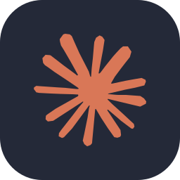</picture>

<picture><source media="(prefers-color-scheme: light)" srcset="assets/svg/en/light/skills-embedded.svg" />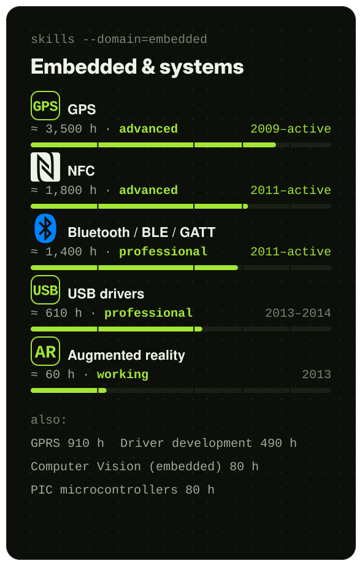</picture> <picture><source media="(prefers-color-scheme: light)" srcset="assets/svg/en/light/skills-mobile.svg" />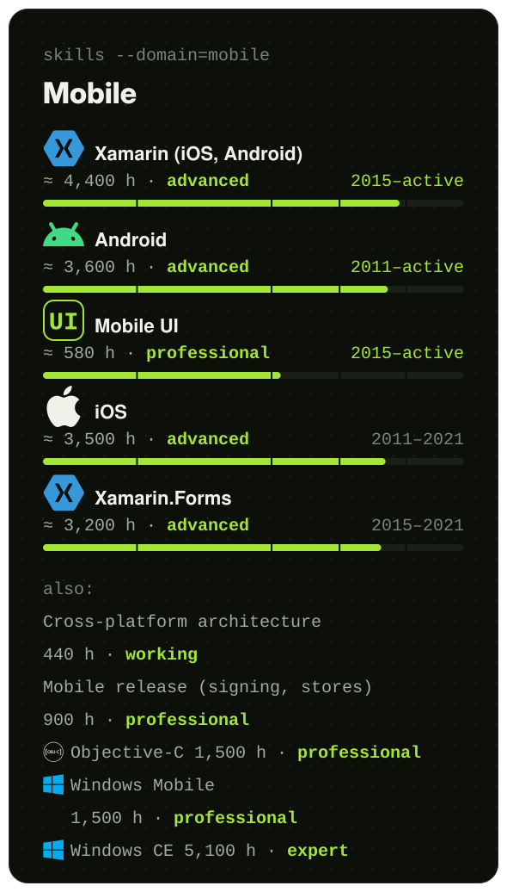</picture>

<picture><source media="(prefers-color-scheme: light)" srcset="assets/svg/en/light/skills-desktop.svg" />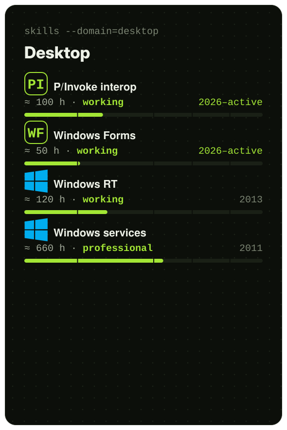</picture> <picture><source media="(prefers-color-scheme: light)" srcset="assets/svg/en/light/skills-languages.svg" />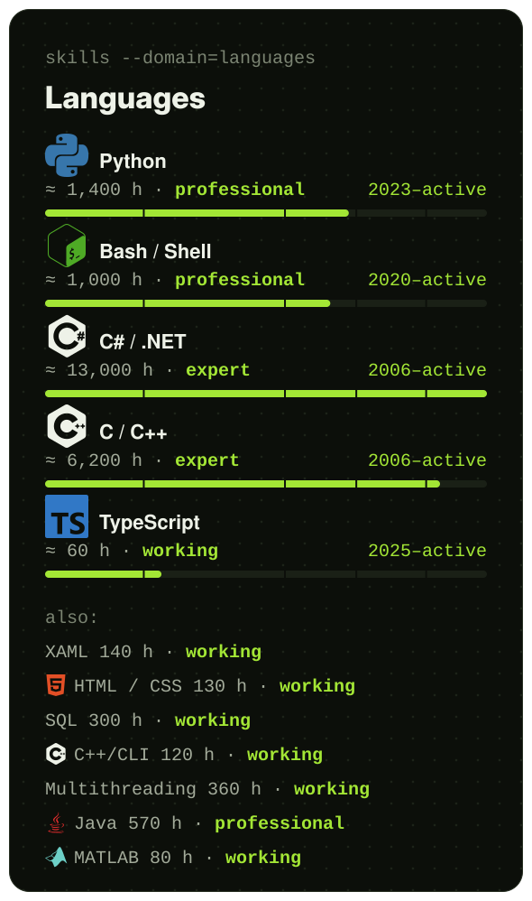</picture>

<picture><source media="(prefers-color-scheme: light)" srcset="assets/svg/en/light/skills-backend.svg" />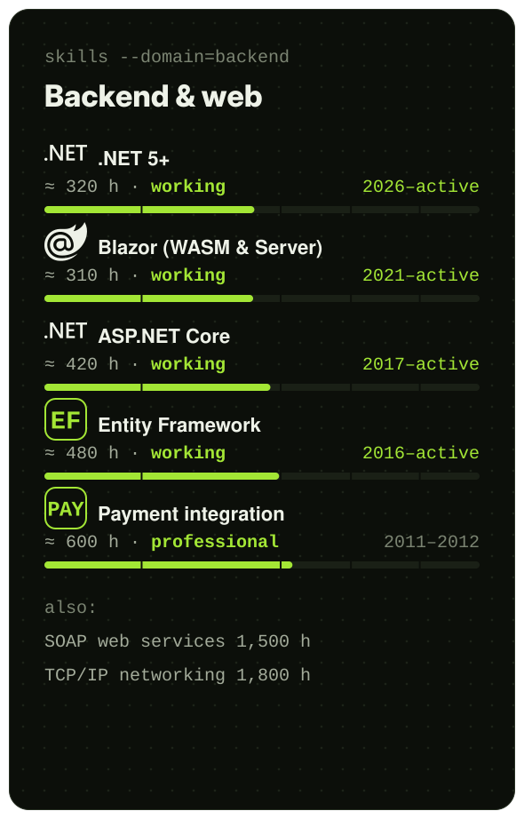</picture> <picture><source media="(prefers-color-scheme: light)" srcset="assets/svg/en/light/skills-devops.svg" /></picture>

<picture><source media="(prefers-color-scheme: light)" srcset="assets/svg/en/light/skills-ai-llm.svg" />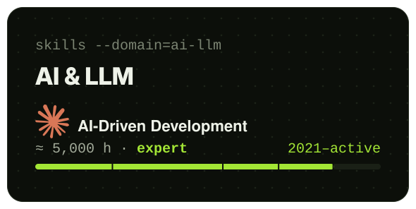</picture> <picture><source media="(prefers-color-scheme: light)" srcset="assets/svg/en/light/skills-blockchain.svg" />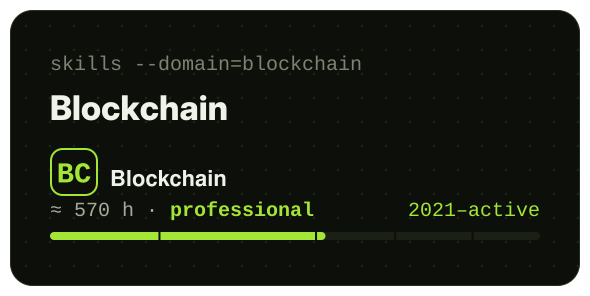</picture>

<picture><source media="(prefers-color-scheme: light)" srcset="assets/svg/en/light/skills-practices.svg" />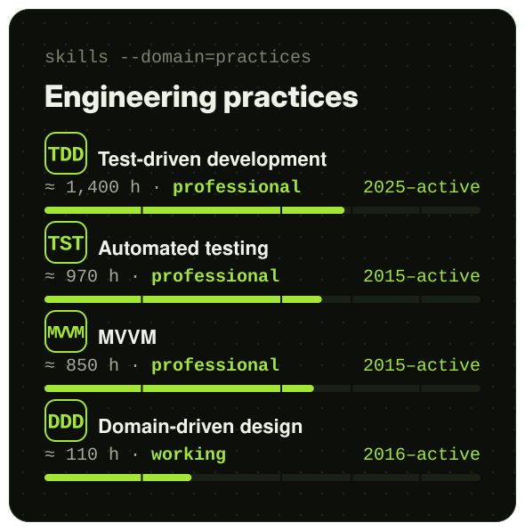</picture>

60 technologies practiced for at least 50 h, across 9 domains and listed from the most recent to the oldest; 24 are active in 2026, including C# / .NET (≈ 13,000 h), C / C++ (≈ 6,200 h) and AI-Driven Development (≈ 5,000 h).

## Timeline

- **2023 → today** · [Independent](pages/en/journey.md#exp-freelance) · _freelance_
- **2014 – 2023** · [Good Angel / My Good Life](pages/en/journey.md#exp-goodangel-mgl-p2) · _permanent position_
- **2013 – 2014** · [Theoris SAS · Ondeo Systems mission](pages/en/journey.md#exp-theoris-ondeo) · _mission_
- **2013** · [Theoris SAS · Dassault Systèmes mission](pages/en/journey.md#exp-theoris-dassault) · _mission_
- **2012 – 2013** · [Theoris SAS · Systar mission](pages/en/journey.md#exp-theoris-systar) · _mission_
- **2011 – 2012** · [Theoris SAS · Ingenico mission](pages/en/journey.md#exp-theoris-ingenico) · _mission_
- **2011** · [Neurones Assistance](pages/en/journey.md#exp-neurones) · _permanent position_
- **2009 – 2010** · [GoodKap!](pages/en/journey.md#exp-goodkap) · _permanent position_
- **2009** · [Gunnebo](pages/en/journey.md#exp-gunnebo) · _internship_
- **2008 – 2009** · [French Robotics Cup](pages/en/journey.md#exp-robotics-cup) · _competition_
- **2006 – 2009** · [University of Reims Champagne-Ardenne](pages/en/journey.md#exp-studies-embedded) · _studies_

11 positions and missions since 2006, newest first; each line leads to its detail on the [journey page](pages/en/journey.md).

## Method

**Hours come from dated traces, never from self-assessment.** A continuous timeline of positions and missions gives professional time, month by month; the 1,474 commit days since 2014 (243 in public repositories) give personal time and each technology's share, read from the added lines. Where no trace exists, the share is declared by the author and counted as such.

**The level is a convention:** working from 50 h, professional from 500 h, advanced from 1,600 h and expert from 5,000 h. The level shown is the higher of the hours level and the level of an attested achievement.

Some career facts rest on the author's statement. No figure on this page is typed by hand: all are computed at generation, and public counters are read live.

## Activity

<picture><source media="(prefers-color-scheme: light)" srcset="assets/svg/en/light/calendar-2014-2020.svg" />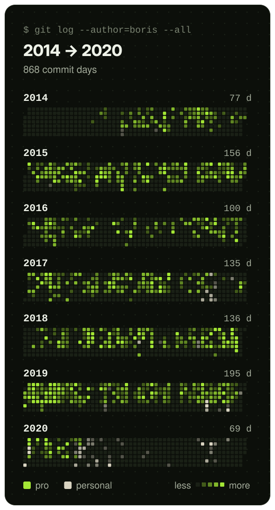</picture> <picture><source media="(prefers-color-scheme: light)" srcset="assets/svg/en/light/calendar-2021-2026.svg" />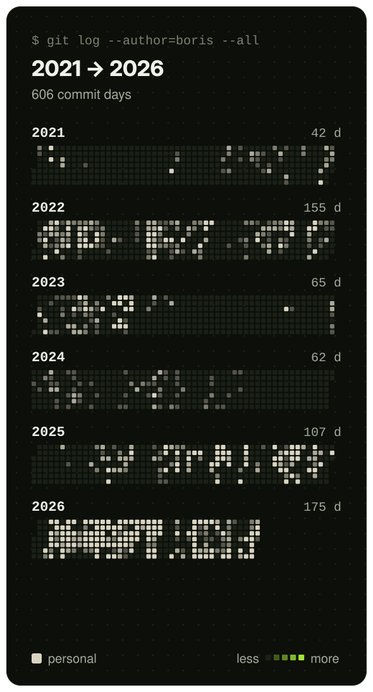</picture>

1,474 commit days since 2014, all sources together: 802 in a professional context, 672 on personal projects; the more intense the cell, the more files that day touched.

### What GitHub sees

<picture><source media="(prefers-color-scheme: light)" srcset="https://raw.githubusercontent.com/Rinzler78/Rinzler78/output/github-contribution-grid-snake.svg" /></picture>

<picture><source media="(prefers-color-scheme: light)" srcset="https://streak-stats.demolab.com/?user=Rinzler78&amp;locale=en&amp;border=d9dfcf&amp;background=fbfcf8&amp;stroke=d9dfcf&amp;ring=3f6212&amp;fire=3f6212&amp;currStreakNum=141810&amp;sideNums=141810&amp;currStreakLabel=3f6212&amp;sideLabels=525a4a&amp;dates=6b7361" /></picture>

These two views count only the contributions GitHub can see; the calendar above also includes private repositories and work done in employment.

## Going further

[Stack](pages/en/stack.md) · [Journey](pages/en/journey.md) · [Projects](pages/en/projects.md) · [Working with me](pages/en/working-with-me.md)

---

Boris Leclere · data as of 2026-10-01 · [how it is measured](#method) 
<code>$ uptime --since=2006 → 20 years, 1,474 commit days, longest streak 21 d, record 195 days in 2019 · still curious_</code>
