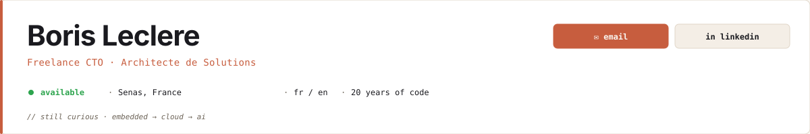
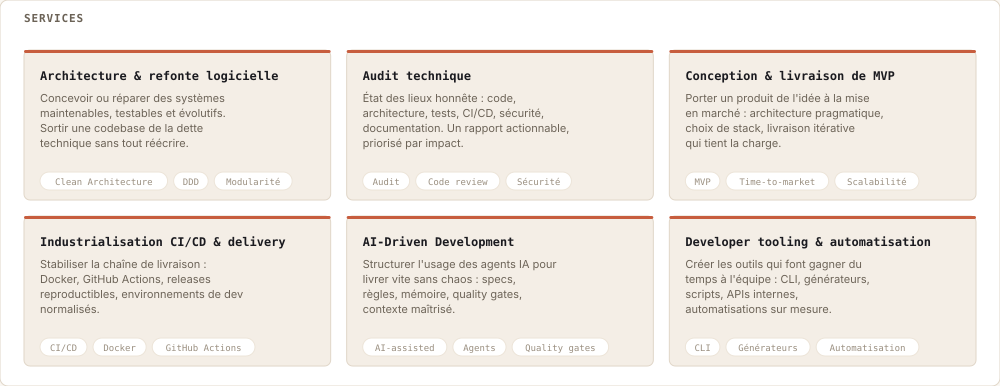
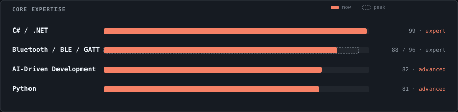
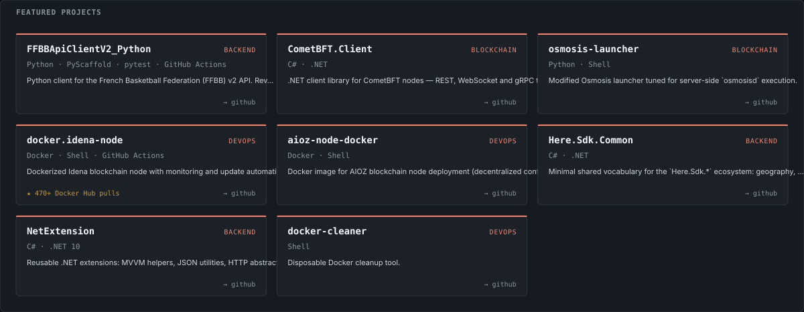
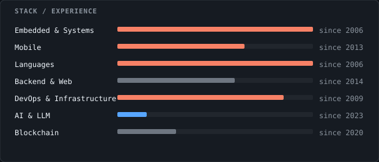
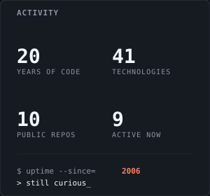
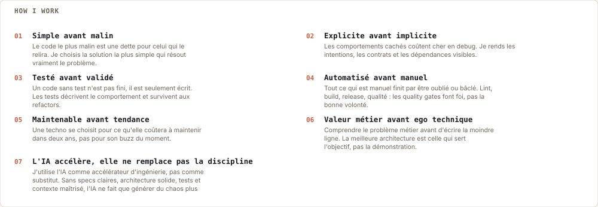
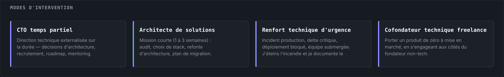

<div align="center">

<a href="mailto:borisleclere.pro@gmail.com">
  
</a>

</div>

<p align="center">

J'accompagne les équipes techniques — **startups en construction comme structures plus matures** — sur leur stratégie logicielle : choix de stack, architecture, dette technique, industrialisation, mise en production. J'aime autant comprendre un protocole bas niveau, orchestrer un pipeline CI/CD que brancher un LLM sur un produit existant. **Mon angle, c'est la polyvalence et une curiosité sincère pour la technologie** — pas un terrain de jeu unique.

</p>

<div align="center">



</div>

<div align="center">



</div>

<div align="center">

<a href="https://github.com/Rinzler78?tab=repositories">
  
</a>

</div>

<table align="center">
  <tr>
    <td valign="top" width="52%">
      
    </td>
    <td valign="top" width="26%">
      
    </td>
    <td valign="top" width="22%">
      
    </td>
  </tr>
</table>

<div align="center">



</div>

<div align="center">



</div>

<div align="center">



</div>

<div align="center">

<a href="mailto:borisleclere.pro@gmail.com"></a>
<a href="https://www.linkedin.com/in/borisleclere"></a>
<a href="https://www.malt.fr/profile/borisleclere"></a>
<a href="https://pypi.org/user/Rinzler78"></a>
<a href="https://discordapp.com/users/rinzler84"></a>
<a href="https://twitter.com/BorisLeclere"></a>

<sub>tel · +33 6 26 26 34 61  &nbsp;·&nbsp;  <code>EOF · boris@github · 2026 — still curious, still shipping_</code></sub>

</div>

<details>
<summary><code>$ cat ~/.bashrc  # easter eggs</code></summary>

```
[OK] curiosity      … mounted at /home/boris
[OK] coffee         … daemon running on :8080
[OK] basketball.so  … loaded since 1991
[WARN] imposter.sys … signal ignored
[OK] embedded.ko    … 2006 → 2013
[OK] mobile.ko      … 2014 → 2023
[OK] cloud.ko       … 2020 →
[OK] llm.ko         … 2023 →
[OK] provence.env   … exported PATH=$PATH:/sunlight
```

```
// pragma: humanity
// FIXME: shave fewer yaks
// ls projects/ --sort=love-desc
// pulse check
// human.boris{ basketball: true, papa: true }
// open socket
```

</details>

<sub align="center">

Coach basket à Pélissanne, en Provence, après avoir attrapé un ballon pour la première fois à 7 ans (et ne l'ayant jamais vraiment lâché depuis). Autodidacte du BEP Électrotechnique au Master Systèmes Embarqués. Papa d'un futur peut-être-développeur.

</sub>

**Liens directs :** [FFBBApiClientV2_Python](https://github.com/Rinzler78/FFBBApiClientV2_Python) · [CometBFT.Client](https://github.com/Rinzler78/CometBFT.Client) · [osmosis-launcher](https://github.com/Rinzler78/osmosis-launcher) · [docker.idena-node](https://github.com/Rinzler78/docker.idena-node) · [aioz-node-docker](https://github.com/Rinzler78/aioz-node-docker) · [Here.Sdk.Common](https://github.com/Rinzler78/Here.Sdk.Common) · [NetExtension](https://github.com/Rinzler78/NetExtension) · [docker-cleaner](https://github.com/Rinzler78/docker-cleaner)