

<b>🇫🇷 Français</b> · <a href="README.en.md">🇬🇧 English</a>

<picture><source media="(prefers-color-scheme: light)" srcset="assets/svg/light/identity.svg" />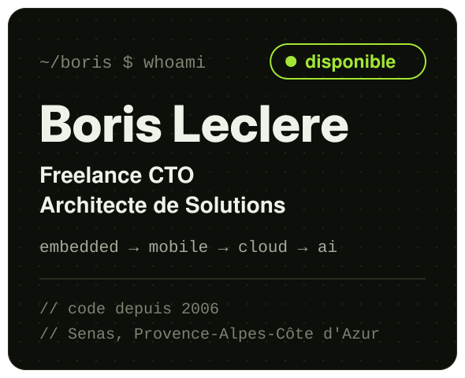</picture> <picture><source media="(prefers-color-scheme: light)" srcset="assets/svg/light/figures.svg" />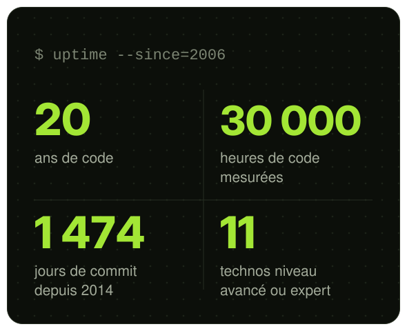</picture>

[borisleclere.pro@gmail.com](mailto:borisleclere.pro@gmail.com) · [LinkedIn](https://www.linkedin.com/in/borisleclere) · [Malt](https://www.malt.fr/profile/borisleclere) · [GitHub](https://github.com/Rinzler78) · [PyPI](https://pypi.org/user/Rinzler78)

Freelance CTO · Architecte de Solutions, je code depuis 2006. Au compteur : 20 ans de code, environ 30 000 heures de pratique mesurées, 1 474 jours de commit depuis 2014 et 11 technologies au niveau avancé ou expert.

## Comment je peux aider

J'accompagne les équipes techniques, des startups en construction aux structures établies, sur 6 types d'intervention :

- **Architecture &amp; refonte logicielle** — Concevoir ou réparer des systèmes maintenables, testables et évolutifs. Sortir une codebase de la dette technique sans tout réécrire.
- **Audit technique** — État des lieux honnête : code, architecture, tests, CI/CD, sécurité, documentation. Un rapport actionnable, priorisé par impact.
- **Conception &amp; livraison de MVP** — Porter un produit de l'idée à la mise en marché : architecture pragmatique, choix de stack, livraison itérative qui tient la charge.
- **Industrialisation CI/CD &amp; delivery** — Stabiliser la chaîne de livraison : Docker, GitHub Actions, releases reproductibles, environnements de dev normalisés.
- **AI-Driven Development** — Structurer l'usage des agents IA pour livrer vite sans chaos : specs, règles, mémoire, quality gates, contexte maîtrisé.
- **Developer tooling &amp; automatisation** — Créer les outils qui font gagner du temps à l'équipe : CLI, générateurs, scripts, APIs internes, automatisations sur mesure.

Formats d'intervention : CTO temps partiel · Architecte de solutions · Renfort technique d'urgence · Cofondateur technique freelance.

## Open source

<picture><source media="(prefers-color-scheme: light)" srcset="assets/svg/light/oss-docker-cleaner.svg" />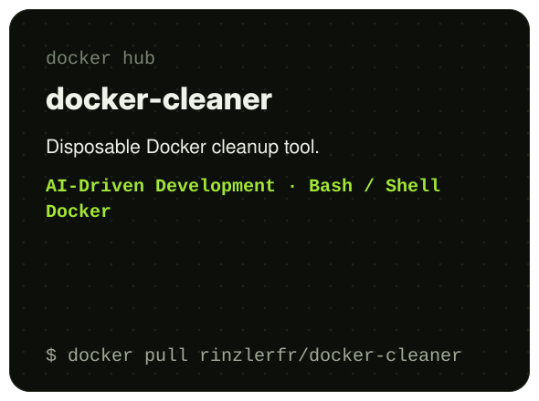</picture> <picture><source media="(prefers-color-scheme: light)" srcset="assets/svg/light/oss-ffbb-api-client-v2.svg" />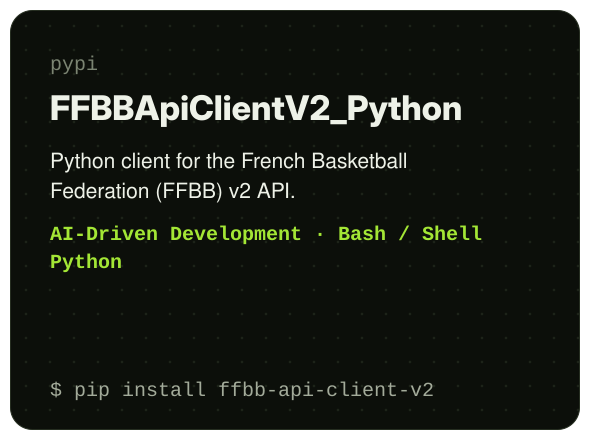</picture>

**docker-cleaner**   &nbsp;·&nbsp; **FFBBApiClientV2_Python**  

<picture><source media="(prefers-color-scheme: light)" srcset="assets/svg/light/oss-aioz-node-docker.svg" />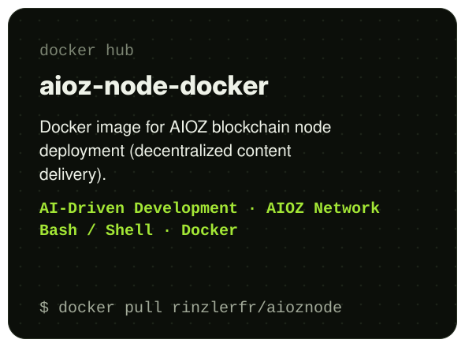</picture> <picture><source media="(prefers-color-scheme: light)" srcset="assets/svg/light/oss-docker-idena-node.svg" />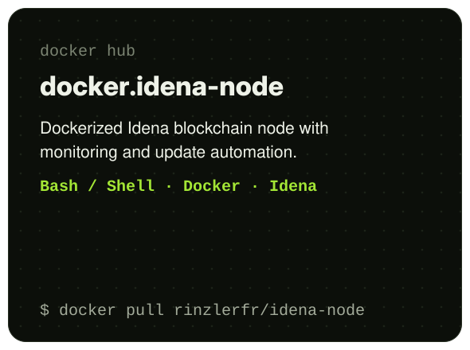</picture>

**aioz-node-docker**   &nbsp;·&nbsp; **docker.idena-node**  

<picture><source media="(prefers-color-scheme: light)" srcset="assets/svg/light/oss-ffbb-api-client-v1.svg" />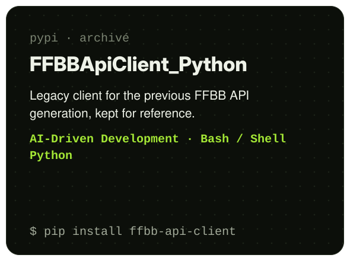</picture> <picture><source media="(prefers-color-scheme: light)" srcset="assets/svg/light/oss-aioz-node-auto-withdraw.svg" />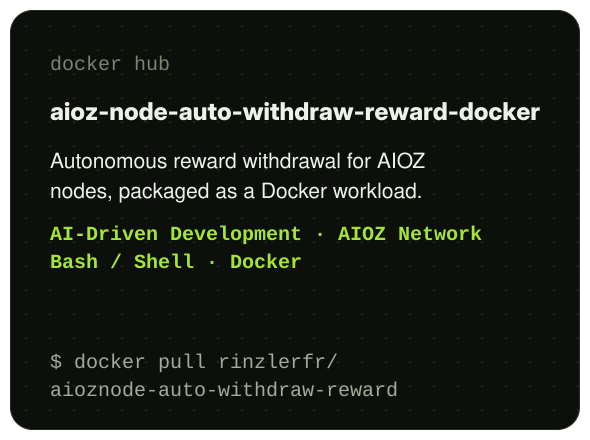</picture>

**FFBBApiClient_Python**   &nbsp;·&nbsp; **aioz-node-auto-withdraw-reward-docker**  

6 projets publics publiés sur Docker Hub et PyPI, avec leurs compteurs lus en direct sous chaque tuile.

## Compétences

<picture><source media="(prefers-color-scheme: light)" srcset="assets/svg/light/skills-band-1.svg" />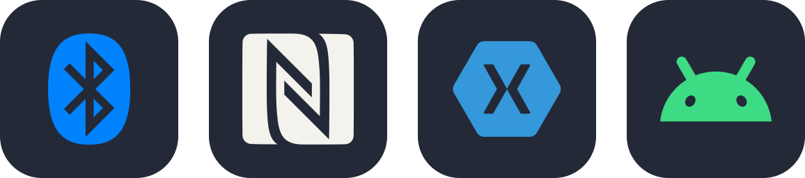</picture> <picture><source media="(prefers-color-scheme: light)" srcset="https://skillicons.dev/icons?i=apple&amp;theme=light&amp;perline=16" /></picture> <picture><source media="(prefers-color-scheme: light)" srcset="assets/svg/light/skills-band-2.svg" /></picture> <picture><source media="(prefers-color-scheme: light)" srcset="https://skillicons.dev/icons?i=windows,py,bash,cs,cpp,ts,html,java,matlab,dotnet&amp;theme=light&amp;perline=16" /></picture> <picture><source media="(prefers-color-scheme: light)" srcset="assets/svg/light/skills-band-3.svg" /></picture> <picture><source media="(prefers-color-scheme: light)" srcset="https://skillicons.dev/icons?i=docker&amp;theme=light&amp;perline=16" /></picture> <picture><source media="(prefers-color-scheme: light)" srcset="assets/svg/light/skills-band-4.svg" /></picture> <picture><source media="(prefers-color-scheme: light)" srcset="https://skillicons.dev/icons?i=git&amp;theme=light&amp;perline=16" /></picture> <picture><source media="(prefers-color-scheme: light)" srcset="assets/svg/light/skills-band-5.svg" /></picture> <picture><source media="(prefers-color-scheme: light)" srcset="https://skillicons.dev/icons?i=linux&amp;theme=light&amp;perline=16" /></picture> <picture><source media="(prefers-color-scheme: light)" srcset="assets/svg/light/skills-band-6.svg" /></picture>

<picture><source media="(prefers-color-scheme: light)" srcset="assets/svg/light/skills-embedded.svg" />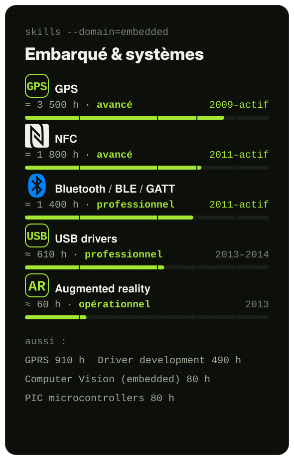</picture> <picture><source media="(prefers-color-scheme: light)" srcset="assets/svg/light/skills-mobile.svg" />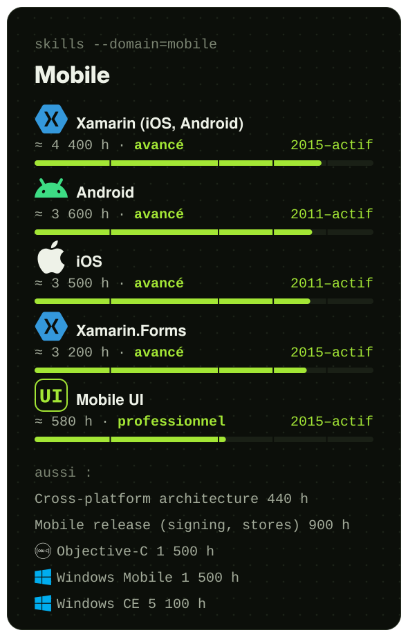</picture>

<picture><source media="(prefers-color-scheme: light)" srcset="assets/svg/light/skills-desktop.svg" />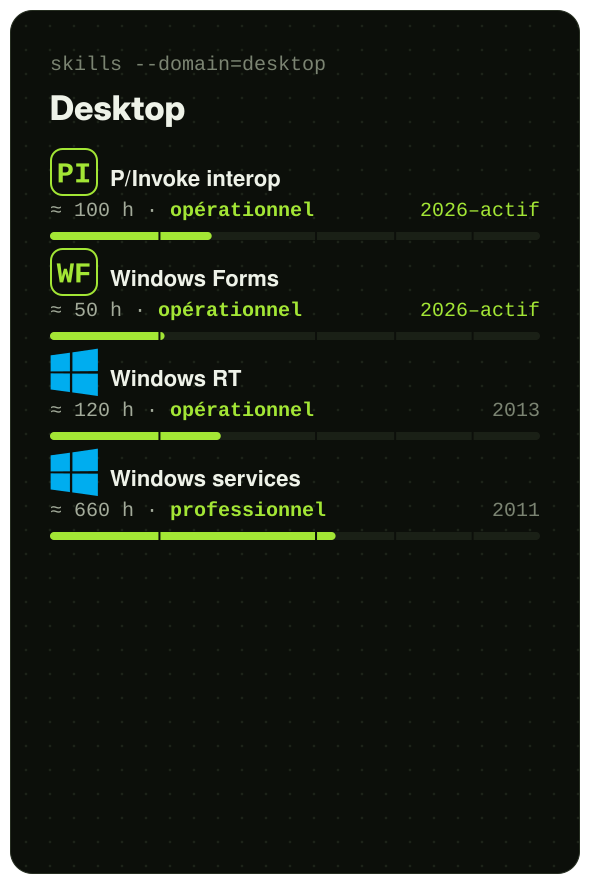</picture> <picture><source media="(prefers-color-scheme: light)" srcset="assets/svg/light/skills-languages.svg" />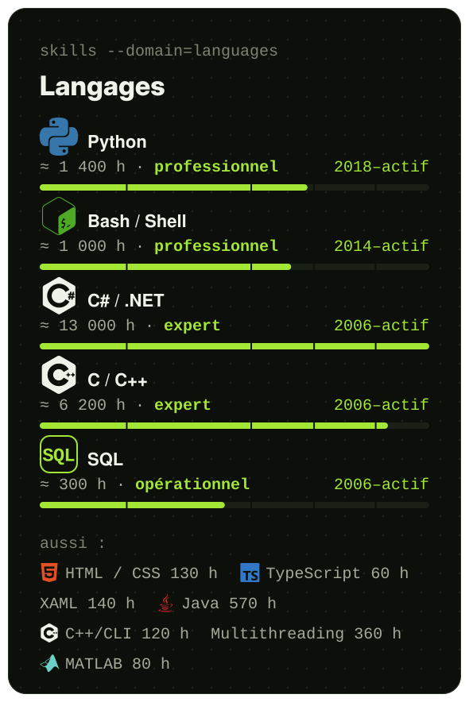</picture>

<picture><source media="(prefers-color-scheme: light)" srcset="assets/svg/light/skills-backend.svg" />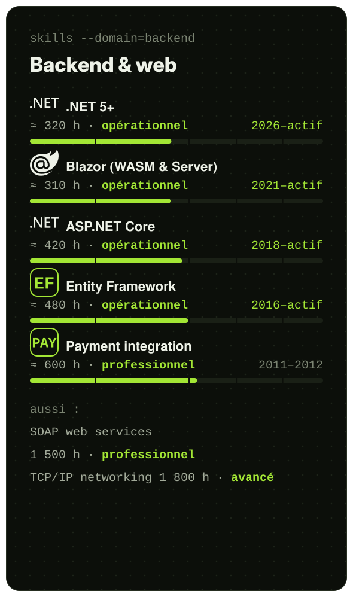</picture> <picture><source media="(prefers-color-scheme: light)" srcset="assets/svg/light/skills-devops.svg" /></picture>

<picture><source media="(prefers-color-scheme: light)" srcset="assets/svg/light/skills-ai-llm.svg" />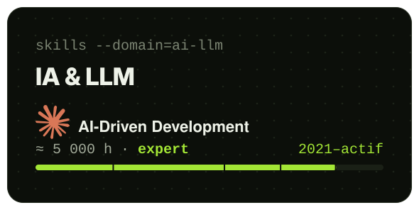</picture> <picture><source media="(prefers-color-scheme: light)" srcset="assets/svg/light/skills-blockchain.svg" />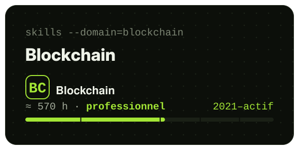</picture>

<picture><source media="(prefers-color-scheme: light)" srcset="assets/svg/light/skills-practices.svg" />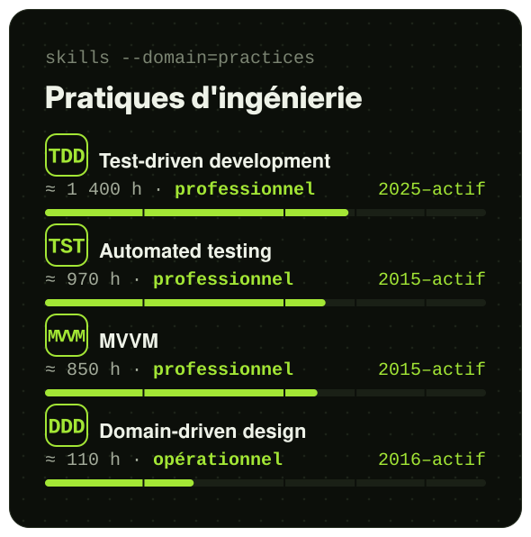</picture>

60 technologies pratiquées au moins 50 h, réparties en 9 domaines et classées de la plus récente à la plus ancienne ; 24 sont actives en 2026, dont C# / .NET (≈ 13 000 h), C / C++ (≈ 6 200 h) et AI-Driven Development (≈ 5 000 h).

## Chronologie

- **2023 → aujourd'hui** · [Indépendant](pages/journey.md#exp-freelance) · _indépendant_
- **2014 – 2023** · [Good Angel / My Good Life](pages/journey.md#exp-goodangel-mgl-p2) · _CDI_
- **2013 – 2014** · [Theoris SAS · mission Ondeo Systems](pages/journey.md#exp-theoris-ondeo) · _mission_
- **2013** · [Theoris SAS · mission Dassault Systèmes](pages/journey.md#exp-theoris-dassault) · _mission_
- **2012 – 2013** · [Theoris SAS · mission Systar](pages/journey.md#exp-theoris-systar) · _mission_
- **2011 – 2012** · [Theoris SAS · mission Ingenico](pages/journey.md#exp-theoris-ingenico) · _mission_
- **2011** · [Neurones Assistance](pages/journey.md#exp-neurones) · _CDI_
- **2009 – 2010** · [GoodKap!](pages/journey.md#exp-goodkap) · _CDI_
- **2009** · [Gunnebo](pages/journey.md#exp-gunnebo) · _stage_
- **2008 – 2009** · [Coupe de France de Robotique](pages/journey.md#exp-robotics-cup) · _compétition_
- **2006 – 2009** · [Université de Reims Champagne-Ardenne](pages/journey.md#exp-studies-embedded) · _études_

11 postes et missions depuis 2006, du plus récent au plus ancien ; chaque ligne mène au détail sur la [page parcours](pages/journey.md).

## Méthode

**Les heures viennent de traces datées, jamais d'une auto-évaluation.** Une chronologie continue des postes et des missions donne le temps professionnel, mois par mois ; les 1 474 jours de commit depuis 2014 (243 dans des dépôts publics) donnent le temps personnel et la part de chaque technologie, lue dans les lignes ajoutées. Là où aucune trace n'existe, la part est déclarée par l'auteur et comptée comme telle.

**Le niveau est une convention :** opérationnel dès 50 h, professionnel dès 500 h, avancé dès 1 600 h et expert dès 5 000 h. Le niveau affiché est le plus haut entre celui des heures et celui d'une réalisation attestée.

Certains faits de carrière reposent sur la déclaration de l'auteur. Aucun chiffre de cette page n'est saisi à la main : tous sont calculés à la génération, et les compteurs publics sont lus en direct.

## Activité

<picture><source media="(prefers-color-scheme: light)" srcset="assets/svg/light/calendar-2014-2020.svg" />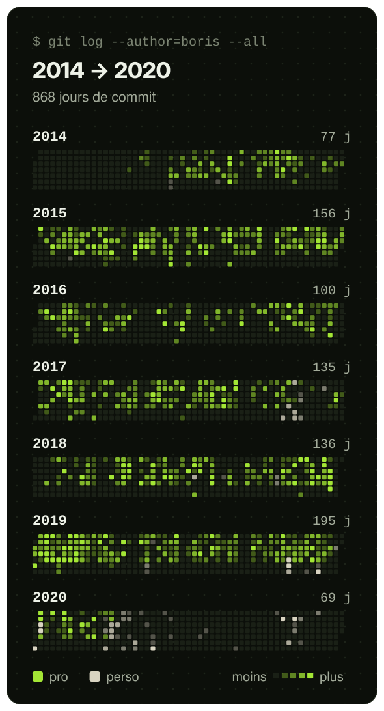</picture> <picture><source media="(prefers-color-scheme: light)" srcset="assets/svg/light/calendar-2021-2026.svg" />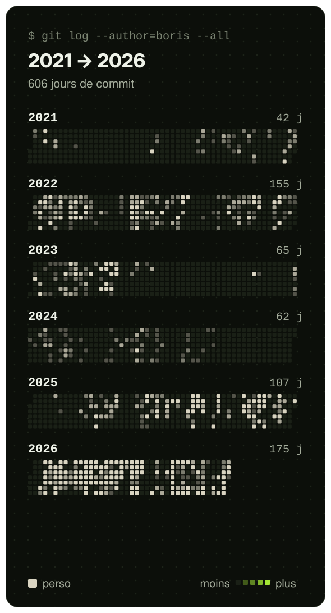</picture>

1 474 jours de commit depuis 2014, toutes sources confondues : 802 dans un contexte professionnel, 672 en projets personnels ; plus la case est intense, plus la journée a touché de fichiers.

### Ce que GitHub voit

<picture><source media="(prefers-color-scheme: light)" srcset="https://raw.githubusercontent.com/Rinzler78/Rinzler78/output/github-contribution-grid-snake.svg" /></picture>

<picture><source media="(prefers-color-scheme: light)" srcset="https://streak-stats.demolab.com/?user=Rinzler78&amp;locale=fr&amp;border=d9dfcf&amp;background=fbfcf8&amp;stroke=d9dfcf&amp;ring=3f6212&amp;fire=3f6212&amp;currStreakNum=141810&amp;sideNums=141810&amp;currStreakLabel=3f6212&amp;sideLabels=525a4a&amp;dates=6b7361" /></picture>

Ces deux vues ne comptent que les contributions visibles par GitHub ; le calendrier ci-dessus inclut aussi les dépôts privés et le travail en poste.

## Pour aller plus loin

[Stack](pages/stack.md) · [Parcours](pages/journey.md) · [Projets](pages/projects.md) · [Travailler avec moi](pages/working-with-me.md)

---

Boris Leclere · données au 2026-10-01 · [comment c'est mesuré](#méthode) 
<code>$ uptime --since=2006 → 20 ans, 1 474 jours de commit, plus longue série 21 j, record 195 jours en 2019 · still curious_</code>
