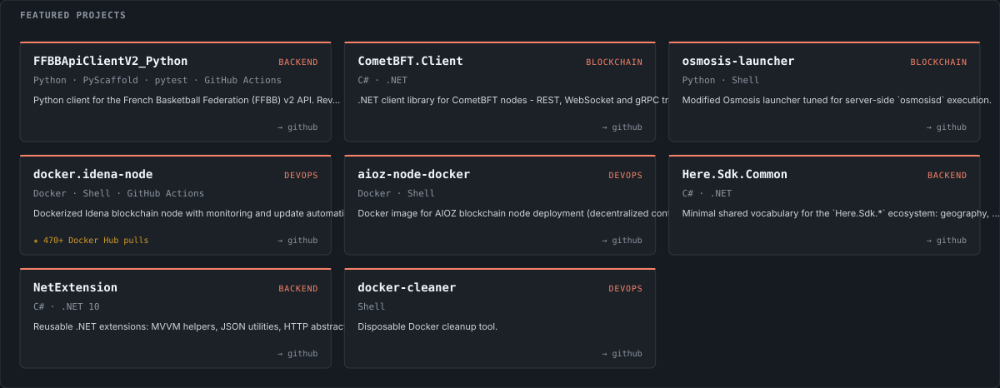

<a href="../../README.en.md">← Back to profile</a>

# Projects

<a href="https://github.com/Rinzler78?tab=repositories">
<picture>
  <source media="(prefers-color-scheme: light)" srcset="../../assets/svg/en/light/featured-projects.svg" />
  
</picture>
</a>

## All public repositories, by domain
**Backend &amp; Web**

| Project | Stack | State | Description |
|---|---|---|---|
| [FFBBApiClientV2_Python](https://github.com/Rinzler78/FFBBApiClientV2_Python) | Python · PyScaffold · pytest · GitHub Actions | active | Python client for the French Basketball Federation (FFBB) v2 API. Reverse-engineered, packaged, published to PyPI, full CI. |
| [Here.Sdk.Common](https://github.com/Rinzler78/Here.Sdk.Common) | C# · .NET | active | Minimal shared vocabulary for the `Here.Sdk.*` ecosystem: geography, units, error model. |
| [NetExtension](https://github.com/Rinzler78/NetExtension) | C# · .NET 10 | active | Reusable .NET extensions: MVVM helpers, JSON utilities, HTTP abstractions. Actively maintained. |
| [FFBBApiClient_Python](https://github.com/Rinzler78/FFBBApiClient_Python) | Python | legacy | Legacy client for the previous FFBB API generation, kept for reference. |
| [XamTetris](https://github.com/Rinzler78/XamTetris) | — | active | Tetris App developed using Xamarin Forms |
| [XamYard](https://github.com/Rinzler78/XamYard) | — | active | XamYard |

**DevOps &amp; Infrastructure**

| Project | Stack | State | Description |
|---|---|---|---|
| [docker.idena-node](https://github.com/Rinzler78/docker.idena-node) | Docker · Shell · GitHub Actions | active | Dockerized Idena blockchain node with monitoring and update automation. Adopted by the Idena community. |
| [aioz-node-docker](https://github.com/Rinzler78/aioz-node-docker) | Docker · Shell | active | Docker image for AIOZ blockchain node deployment (decentralized content delivery). |
| [docker-cleaner](https://github.com/Rinzler78/docker-cleaner) | Shell | active | Disposable Docker cleanup tool. |
| [aioz-node-auto-withdraw-reward-docker](https://github.com/Rinzler78/aioz-node-auto-withdraw-reward-docker) | Docker · Shell | active | Autonomous reward withdrawal for AIOZ nodes, packaged as a Docker workload. |

**Blockchain**

| Project | Stack | State | Description |
|---|---|---|---|
| [CometBFT.Client](https://github.com/Rinzler78/CometBFT.Client) | C# · .NET | active | .NET client library for CometBFT nodes - REST, WebSocket and gRPC transports, generic block model. |
| [osmosis-launcher](https://github.com/Rinzler78/osmosis-launcher) | Python · Shell | active | Modified Osmosis launcher tuned for server-side `osmosisd` execution. |

<a href="../../README.en.md">← Back to profile</a>
