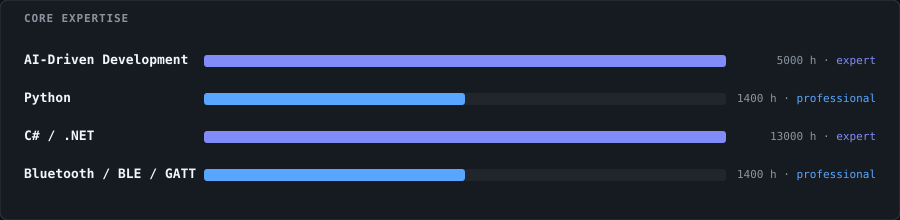
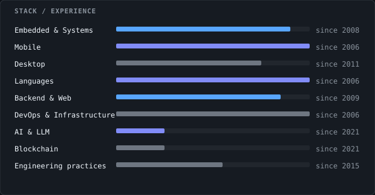
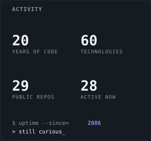

<sub><a href="../../README.en.md">← Back to profile</a></sub>

# Technical stack
<div align="center">
<picture>
  <source media="(prefers-color-scheme: light)" srcset="../../assets/svg/en/light/core-expertise.svg" />
  
</picture>
</div>

<table align="center">
  <tr>
    <td valign="top" width="70%">
      <picture>
  <source media="(prefers-color-scheme: light)" srcset="../../assets/svg/en/light/stack-summary.svg" />
  
</picture>
    </td>
    <td valign="top" width="30%">
      <picture>
  <source media="(prefers-color-scheme: light)" srcset="../../assets/svg/en/light/activity-stats.svg" />
  
</picture>
    </td>
  </tr>
</table>

## All skills, by domain
**Embedded &amp; Systems**

| Skill | Hours | Level | Active | Versions |
|---|---|---|---|---|
| GPS | 3500 | advanced | 2009–now | NMEA · A-GPS |
| NFC | 1800 | advanced | 2011–now | ISO 14443 / 15693 (Mifare) |
| Bluetooth / BLE / GATT | 1400 | professional | 2011–now | Classic + BLE 4.x · custom GATT |
| USB drivers | 610 | professional | 2013–2014 | — |
| Augmented reality | 60 | working | 2013–2013 | — |
| GPRS | 910 | professional | 2009–2010 | — |
| Driver development | 490 | working | 2009–2009 | — |
| Computer Vision (embedded) | 80 | working | 2008–2009 | Industrial camera · PIC16F1938 |
| PIC microcontrollers | 80 | working | 2008–2009 | — |

**Mobile**

| Skill | Hours | Level | Active | Versions |
|---|---|---|---|---|
| Xamarin (iOS, Android) | 4400 | advanced | 2015–now | — |
| Android | 3600 | advanced | 2011–now | — |
| iOS | 3500 | advanced | 2011–now | — |
| Xamarin.Forms | 3200 | advanced | 2015–now | Forms 2.3 → 4.7 · Essentials 1.x |
| Mobile UI | 580 | professional | 2015–now | — |
| Cross-platform architecture | 440 | working | 2015–now | — |
| Mobile release (signing, stores) | 900 | professional | 2014–now | — |
| Objective-C | 1500 | professional | 2011–2025 | iOS 5 → 10 |
| Windows Mobile | 1500 | professional | 2006–2014 | 6.x |
| Windows CE | 5100 | expert | 2006–2012 | 5.0 / 6.0 |

**Desktop**

| Skill | Hours | Level | Active | Versions |
|---|---|---|---|---|
| P/Invoke interop | 100 | working | 2026–now | — |
| Windows Forms | 50 | working | 2026–now | — |
| Windows RT | 120 | working | 2013–2013 | — |
| Windows services | 660 | professional | 2011–2011 | — |

**Languages**

| Skill | Hours | Level | Active | Versions |
|---|---|---|---|---|
| Python | 1400 | professional | 2018–now | 3.11+ |
| Bash / Shell | 1000 | professional | 2014–now | Bash 5.x |
| C# / .NET | 13000 | expert | 2006–now | C# 2.0 → 13 · .NET Framework 2.0 → .NET 10 |
| C / C++ | 6200 | expert | 2006–now | C99 · C++11 · C++/CLI |
| SQL | 300 | working | 2006–now | — |
| HTML / CSS | 130 | working | 2014–now | — |
| TypeScript | 60 | working | 2025–now | 5.x |
| XAML | 140 | working | 2015–now | — |
| Java | 570 | professional | 2011–2025 | — |
| C++/CLI | 120 | working | 2013–2013 | — |
| Multithreading | 360 | working | 2012–2013 | — |
| MATLAB | 80 | working | 2006–2009 | — |

**Backend &amp; Web**

| Skill | Hours | Level | Active | Versions |
|---|---|---|---|---|
| .NET 5+ | 320 | working | 2026–now | — |
| Blazor (WASM &amp; Server) | 310 | working | 2021–now | .NET 6+ |
| ASP.NET Core | 420 | working | 2017–now | 2.2 → 8 |
| Entity Framework | 480 | working | 2016–now | EF6 → EF Core 3.1+ |
| Payment integration | 600 | professional | 2011–2012 | — |
| SOAP web services | 1500 | professional | 2009–2011 | — |
| TCP/IP networking | 1800 | advanced | 2009–2010 | — |

**DevOps &amp; Infrastructure**

| Skill | Hours | Level | Active | Versions |
|---|---|---|---|---|
| Docker | 770 | professional | 2020–now | 24.x+ · Compose v2 |
| Virtual machines | 440 | working | 2014–now | — |
| Azure DevOps | 270 | working | 2019–now | — |
| Cross-compilation toolchains | 210 | working | 2012–now | — |
| Git server | 170 | working | 2013–2014 | — |
| TestLink | 170 | working | 2013–2014 | — |
| IBM AIX | 720 | professional | 2012–2013 | — |
| Windows | 360 | working | 2012–2013 | 3.11 → 11 + Server |
| Windows Server | 920 | professional | 2009–2011 | — |
| Active Directory | 660 | professional | 2011–2011 | — |
| VMware | 660 | professional | 2011–2011 | — |
| Linux | 300 | working | 2006–2009 | — |

**AI &amp; LLM**

| Skill | Hours | Level | Active | Versions |
|---|---|---|---|---|
| AI-Driven Development | 5000 | expert | 2021–now | Claude Code (primary) · Codex · OpenCode · ChatGPT |

**Blockchain**

| Skill | Hours | Level | Active | Versions |
|---|---|---|---|---|
| Blockchain | 570 | professional | 2021–now | — |

**Engineering practices**

| Skill | Hours | Level | Active | Versions |
|---|---|---|---|---|
| Test-driven development | 1400 | professional | 2025–now | — |
| Automated testing | 970 | professional | 2015–now | — |
| MVVM | 850 | professional | 2015–now | — |
| Domain-driven design | 110 | working | 2016–now | — |


<details>
<summary><code>$ cat Boris.cs  # profile as code</code></summary>

```csharp
public sealed class BorisLeclere : FreelanceCto
{
    public string[] CoreSkills => ["AI-Driven Development", "Python", "C# / .NET", "Bluetooth / BLE / GATT"];
    public string[] Services   => ["Software architecture & redesign", "Technical audit", "MVP design & delivery", "CI/CD industrialization & delivery", "AI-Driven Development", "Developer tooling & automation"];
    public string   Status     => "available";
}
```

</details>

<sub><a href="../../README.en.md">← Back to profile</a></sub>
