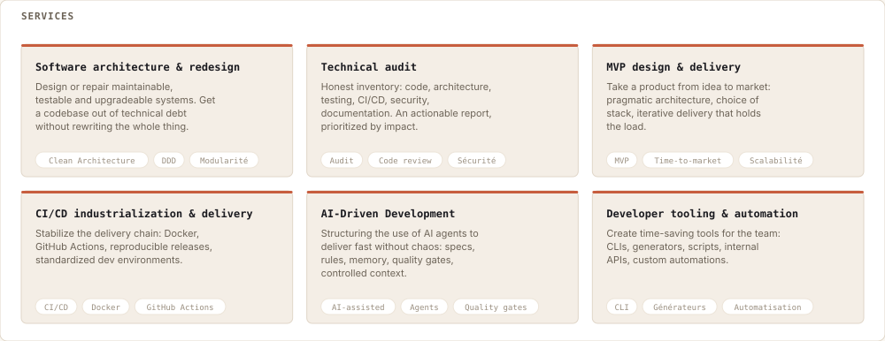
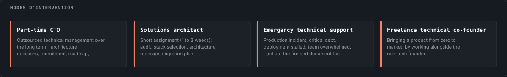
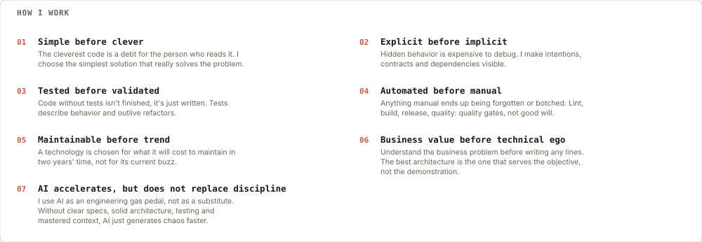

<a href="../../README.en.md">← Back to profile</a>

# Working with me

<picture>
  <source media="(prefers-color-scheme: dark)" srcset="../../assets/svg/en/dark/services.svg" />
  
</picture>

## What you can buy
- **Software architecture &amp; redesign** — Design or repair maintainable, testable and upgradeable systems. Get a codebase out of technical debt without rewriting the whole thing.
- **Technical audit** — Honest inventory: code, architecture, testing, CI/CD, security, documentation. An actionable report, prioritized by impact.
- **MVP design &amp; delivery** — Take a product from idea to market: pragmatic architecture, choice of stack, iterative delivery that holds the load.
- **CI/CD industrialization &amp; delivery** — Stabilize the delivery chain: Docker, GitHub Actions, reproducible releases, standardized dev environments.
- **AI-Driven Development** — Structuring the use of AI agents to deliver fast without chaos: specs, rules, memory, quality gates, controlled context.
- **Developer tooling &amp; automation** — Create time-saving tools for the team: CLIs, generators, scripts, internal APIs, custom automations.

<picture>
  <source media="(prefers-color-scheme: dark)" srcset="../../assets/svg/en/dark/modes.svg" />
  
</picture>

## How to engage me
- **Part-time CTO** — Outsourced technical management over the long term - architecture decisions, recruitment, roadmap, mentoring.
- **Solutions architect** — Short assignment (1 to 3 weeks): audit, stack selection, architecture redesign, migration plan.
- **Emergency technical support** — Production incident, critical debt, deployment stalled, team overwhelmed. I put out the fire and document the return to stability.
- **Freelance technical co-founder** — Bringing a product from zero to market, by working alongside the non-tech founder.

<picture>
  <source media="(prefers-color-scheme: dark)" srcset="../../assets/svg/en/dark/methodology.svg" />
  
</picture>

## How I work
- **Simple before clever** — The cleverest code is a debt for the person who reads it. I choose the simplest solution that really solves the problem.
- **Explicit before implicit** — Hidden behavior is expensive to debug. I make intentions, contracts and dependencies visible.
- **Tested before validated** — Code without tests isn't finished, it's just written. Tests describe behavior and outlive refactors.
- **Automated before manual** — Anything manual ends up being forgotten or botched. Lint, build, release, quality: quality gates, not good will.
- **Maintainable before trend** — A technology is chosen for what it will cost to maintain in two years' time, not for its current buzz.
- **Business value before technical ego** — Understand the business problem before writing any lines. The best architecture is the one that serves the objective, not the demonstration.
- **AI accelerates, but does not replace discipline** — I use AI as an engineering gas pedal, not as a substitute. Without clear specs, solid architecture, testing and mastered context, AI just generates chaos faster.

<a href="../../README.en.md">← Back to profile</a>
