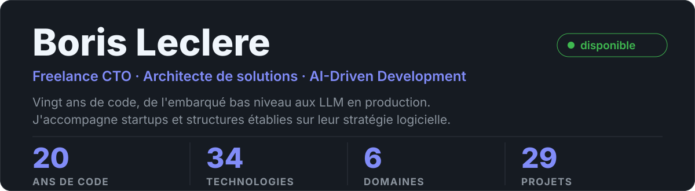

<!-- PROTOTYPE: throwaway, see prototype/bento/build.py -->

[Index](README.fr.md) · [A — Bento](variant-a.fr.md) · [B — CV deux colonnes](variant-b.fr.md) · [C — Chiffres d'abord](variant-c.fr.md)

## Variante A — Bento

Hero pleine largeur avec les chiffres clés, puis une rangée de deux demi-tuiles.

<picture><source media="(prefers-color-scheme: light)" srcset="svg/light/hero.svg" /></picture>

<picture><source media="(prefers-color-scheme: light)" srcset="svg/light/skills.svg" /></picture> <picture><source media="(prefers-color-scheme: light)" srcset="svg/light/domains.svg" /></picture>

<a href="mailto:borisleclere.pro@gmail.com"><picture><source media="(prefers-color-scheme: light)" srcset="svg/light/chip-email.svg" /></picture></a> <a href="https://www.linkedin.com/in/borisleclere"><picture><source media="(prefers-color-scheme: light)" srcset="svg/light/chip-linkedin.svg" /></picture></a> <a href="https://www.malt.fr/profile/borisleclere"><picture><source media="(prefers-color-scheme: light)" srcset="svg/light/chip-malt.svg" /></picture></a> <a href="https://wa.me/33626263461"><picture><source media="(prefers-color-scheme: light)" srcset="svg/light/chip-whatsapp.svg" /></picture></a> <a href="https://github.com/Rinzler78"><picture><source media="(prefers-color-scheme: light)" srcset="svg/light/chip-github.svg" /></picture></a> <a href="https://pypi.org/user/Rinzler78"><picture><source media="(prefers-color-scheme: light)" srcset="svg/light/chip-pypi.svg" /></picture></a>

### Où le temps est passé

L'arc se lit directement : embarqué jusqu'en 2013, mobile jusqu'en 2019, cloud ensuite, IA depuis 2023.

<picture><source media="(prefers-color-scheme: light)" srcset="../../assets/svg/light/journey-share.svg" /></picture>

↑ Tuile existante, gardée telle quelle pour juger le raccord avec la grille.
