<!-- PROTOTYPE: throwaway, see prototype/front-v2/build.py -->

> **PROTOTYPE — données du spike.** Maquette jetable de la façade v2 (ADR-015). Les heures et les jours de commit viennent d'un modèle exploratoire, pas encore du pipeline.

<picture><source media="(prefers-color-scheme: light)" srcset="svg/light/identity.svg" />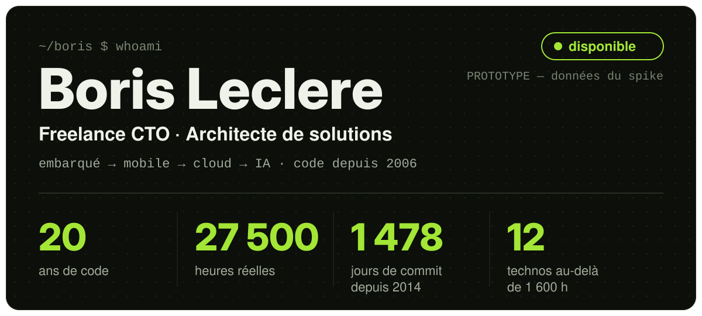</picture>

[borisleclere.pro@gmail.com](mailto:borisleclere.pro@gmail.com) · [LinkedIn](https://www.linkedin.com/in/borisleclere) · [Malt](https://www.malt.fr/profile/borisleclere) · [PyPI](https://pypi.org/user/Rinzler78)

Freelance CTO et architecte de solutions, je code depuis 2006 — de l'embarqué aux LLM. Au compteur : 20 ans de code, environ 27 500 heures réelles, 1 478 jours de commit depuis 2014 et 12 technologies pratiquées plus de 1 600 heures.

## Comment je peux aider

J'accompagne les équipes techniques, des startups en construction aux structures établies, sur six types d'intervention :

- **Architecture & refonte logicielle** — Concevoir ou réparer des systèmes maintenables, testables et évolutifs. Sortir une codebase de la dette technique sans tout réécrire.
- **Audit technique** — État des lieux honnête : code, architecture, tests, CI/CD, sécurité, documentation. Un rapport actionnable, priorisé par impact.
- **Conception & livraison de MVP** — Porter un produit de l'idée à la mise en marché : architecture pragmatique, choix de stack, livraison itérative qui tient la charge.
- **Industrialisation CI/CD & delivery** — Stabiliser la chaîne de livraison : Docker, GitHub Actions, releases reproductibles, environnements de dev normalisés.
- **AI-Driven Development** — Structurer l'usage des agents IA pour livrer vite sans chaos : specs, règles, mémoire, quality gates, contexte maîtrisé.
- **Developer tooling & automatisation** — Créer les outils qui font gagner du temps à l'équipe : CLI, générateurs, scripts, APIs internes, automatisations sur mesure.

## Preuves

Deux projets publics dont l'usage se mesure de l'extérieur, relevés le 2026-09-26.

<picture><source media="(prefers-color-scheme: light)" srcset="svg/light/proof-pypi.svg" />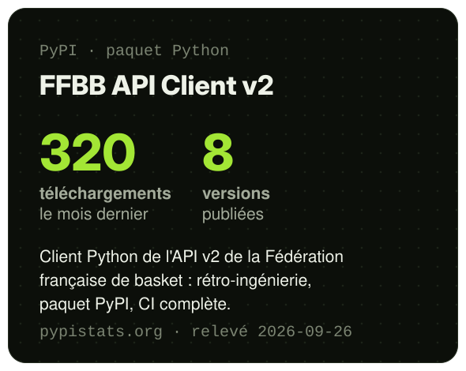</picture> <picture><source media="(prefers-color-scheme: light)" srcset="svg/light/proof-docker.svg" />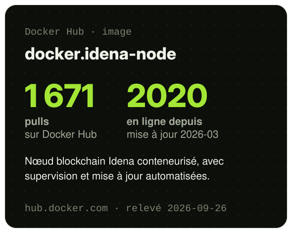</picture>

Le client Python de l'API FFBB compte 320 téléchargements le mois dernier et 8 versions publiées ; l'image Docker du nœud Idena totalise 1 671 pulls sur Docker Hub.

## Compétences par domaine

Chaque technologie avec ses heures réelles, son niveau, sa période et son dernier usage.

<picture><source media="(prefers-color-scheme: light)" srcset="svg/light/skills-languages.svg" />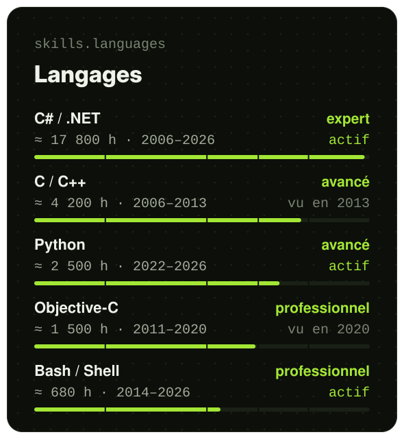</picture> <picture><source media="(prefers-color-scheme: light)" srcset="svg/light/skills-mobile_embedded.svg" />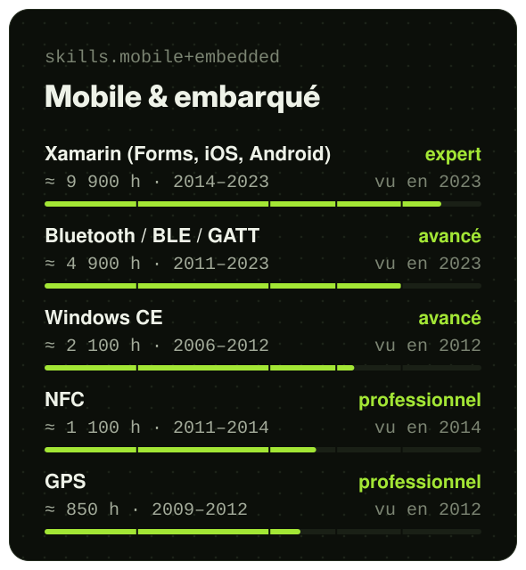</picture>

<picture><source media="(prefers-color-scheme: light)" srcset="svg/light/skills-backend_devops.svg" />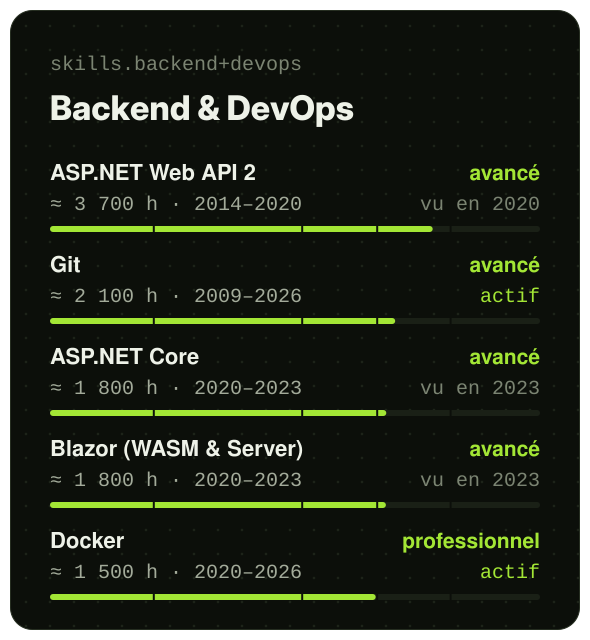</picture> <picture><source media="(prefers-color-scheme: light)" srcset="svg/light/skills-ai_chain.svg" />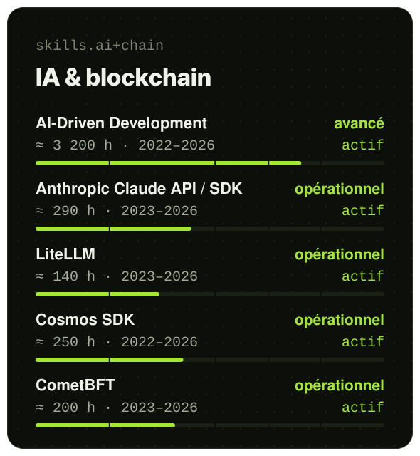</picture>

En tête : C# / .NET avec environ 17 800 heures depuis 2006, Xamarin avec près de 10 000 heures, et l'AI-Driven Development déjà au niveau avancé en quatre ans.

Niveaux par convention, fixés sur les heures : opérationnel ≥ 50 h · professionnel ≥ 500 h · avancé ≥ 1 600 h · expert ≥ 5 000 h. C'est une convention de lecture, pas une certification.

## Parcours

Chaque activité en une ligne ; de 2014 à 2020, deux emplois menés en parallèle sur la même période.

<picture><source media="(prefers-color-scheme: light)" srcset="svg/light/timeline-a.svg" />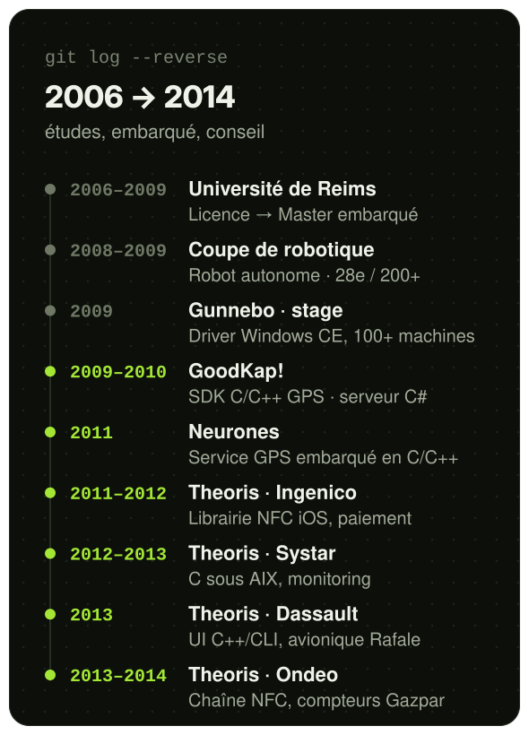</picture> <picture><source media="(prefers-color-scheme: light)" srcset="svg/light/timeline-b.svg" />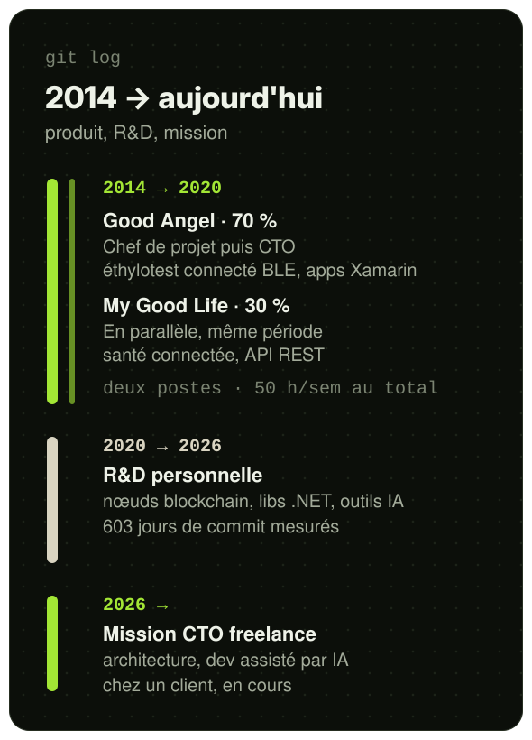</picture>

Trois ans d'études, puis près de cinq ans d'embarqué et de missions de conseil jusqu'en 2014 ; six ans de double poste chez Good Angel et My Good Life ; six ans de R&D personnelle ; une mission CTO freelance depuis juin 2026. [voir le détail →](../../pages/journey.md)

## Méthode

**Les heures viennent de deux traces, jamais d'une auto-évaluation.** Le calendrier des postes et des missions donne les heures pro (heures hebdomadaires × 47 semaines par an, 30 pour les études) ; les commits datés donnent l'activité personnelle, à 3 heures par jour de commit.

**Rien n'est compté deux fois.** Les deux emplois de 2014–2020 forment une seule source de 50 h par semaine ; un jour de commit pendant un poste salarié ne rajoute pas d'heures.

**Couverture.** Les commits couvrent avril 2014 → 2026-09-26 (1 478 jours distincts) ; avant 2014, seules les dates des postes existent. Les heures personnelles sont un plancher : un jour sans commit compte zéro.

## Activité

Chaque jour de commit depuis avril 2014, toutes sources confondues, coloré par contexte.

<picture><source media="(prefers-color-scheme: light)" srcset="svg/light/calendar-a.svg" />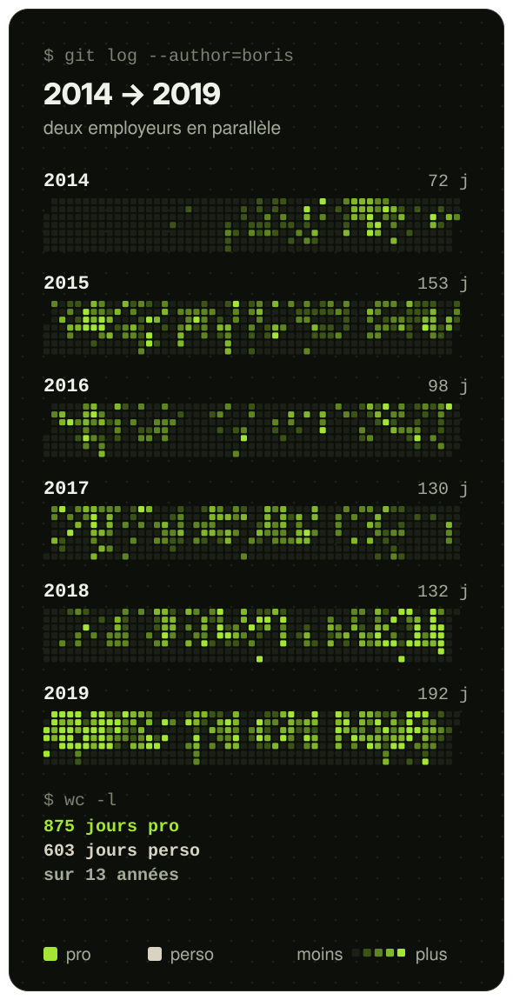</picture> <picture><source media="(prefers-color-scheme: light)" srcset="svg/light/calendar-b.svg" />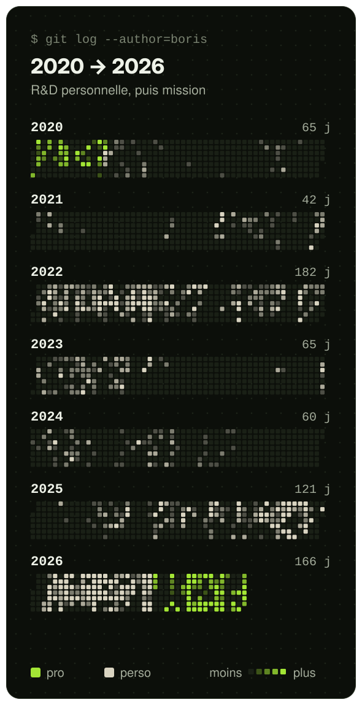</picture>

1 478 jours de commit au total : 875 dans un contexte professionnel, 603 en R&D personnelle ; plus la case est intense, plus la journée a touché de fichiers.

<picture><source media="(prefers-color-scheme: light)" srcset="svg/light/history-hours.svg" />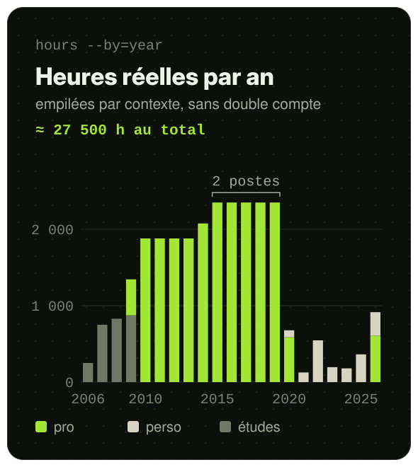</picture> <picture><source media="(prefers-color-scheme: light)" srcset="svg/light/history-weight.svg" />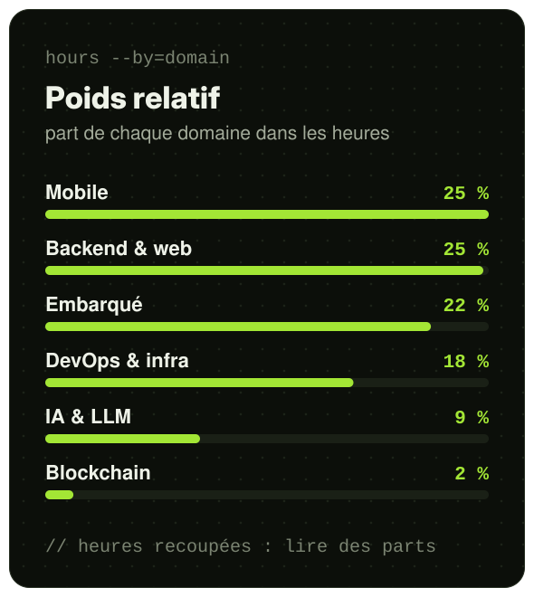</picture>

Le volume culmine à 2 350 heures par an pendant le double poste de 2015 à 2019 ; après 2020, seules les journées de commit comptent, d'où des barres basses qui sont un plancher. En poids relatif, Mobile et backend & web arrivent en tête ; les parts se lisent entre elles, car une même heure peut compter dans plusieurs domaines.

---

Boris Leclere · données au 2026-09-26 · [comment c'est mesuré](#méthode) 
<code>$ uptime --since=2006 → 20 ans, 1 478 jours de commit, streak max 19 j · still curious_</code>
